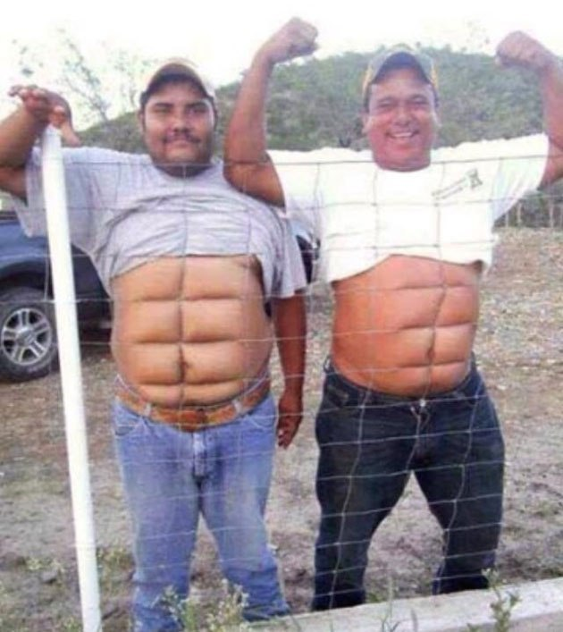

*"سأحمل هذا الهراء على ظهري اللعين "*
-------------------------------------
بدون اي مقدمات، فقد كانت هذه إحدى اللقطات التي تعرض في أحد أندية كمال الأجسام، والتي تعرض بطبيعة الحال للتحفيز على التمرين.

ولأكون صريحاً فالترجمة الحرفية –كما يعلم الجميع – ليست الهراء ولا اللعين، ولكنها ما جادت به قريحة المترجم على الشاشة، وبالصدفة كانت هي الكلمات الوحيدة طوال الفيديو، وبقية الفيديو عرض لفيلة ووحوش متنكرين بأجسام بشرية وكتل عضلية تحتاج آلاف الأرطال من الغذاء اليومي والأمينو، وأرنولد شوازينجر الذي يطلع بكل فيديو، وما أدراك!

وأنا أظن إن لم أجزم أن كل مرتادي النادي لا يحلمون بمثل هذه الأجسام أبداً، ولكم أن تتخيلوا أن يكون حجم ذراعك أكبر من فخذك وفخذك أكبر من أي شيء حولك.

عندما دخلت النادي لأول مرة صدمت بعبارة مكتوبة على أعلى الرف، go heavy or go home ، تخبرك العبارة بأن تتدرب بشدة أو اذهب للمنزل، في طريقة مستفزة جداً، تجعلك تقول أنا قدها، ولن أذهب للبيت إلا بعد أن يمتلئ جسمي بالشد العضلي ولا أستطيع أن ألبس الجاكت، وهذا ما حدث بالضبط بالنسبة لي. ولوحة أخرى تقول لي لا حيازة بدون ألم، وهاتيك من ألم يا سيدي المدرب.

من الملاحظ أيضا أن هناك من الناس الذين لا تراهم في الشارع والحياة الطبيعية الاعتيادية ولكنهم موجودون دائماً وأبداً في هذه النوادي، وجسمهم لم يتغير ملليمتراً واحداً، ومنهم الكابتن بشير، الذي معه كرش يطيح جمل، ولكن الكل يكن له الاحترام –بصفته كابتن وليس بصفة أخرى – ولا يكتفون بذلك ولكن يسألونه عندما لا يستطيعون أداء التمرين بالشكل المطلوب! وهذا ما يقهرني دائماً. لم أرى هذا الكابتن يتدرب بأكثر ما تدربت به أنا علما بأني لم أتم 3 أشهر متكاملة، ولكنه رزق لا يمكن إغفاله، القَبَلًة من الله، وفي الحقيقة فهو لاعب بلياردو محترف ومطقطق عالمي.

 في رمضان، كان الصوت المشغل ماهر زين، وبقية السنة أجنبي وراب وهراء لعين آخر، ولكن في يوم الخميس تُشغل أغاني عربية من أسوأ ما سمعت، رابح صقر وتلكم الشلة. لماذا؟ حقاً إنه سؤال محير.

ولك أيها المبتدئ أن تتجنب كل الكدمات الغير مقصودة من البارات والدامبلز، أي الأثقال المتناثرة هنا وهناك، وحذاري أن تسهو وأنت ترتب الثقل المناسب في حين يأتي الانتهازيون ويتدربون وكأن شيئا لم يكن، وإياك أن تجري على آلة الجري عندما يكون على مولد الكهرباء الصغير، وكل الحذر أن تترك الأثقال على الأرض بعد التدريب لأن الكابتن بشير يزعل جدا، دائماً وأبداً مع الكابتن بشير.

يا وحش الجيم، أيوة وحش، يا قوي، إديييي لوووووه، يالله، يا وحش، أيووووووة

كل ما سبق من الكلمات لا يسمع صداها إلا من المدرب، يستطيع هؤلاء المدربون نطقها بصور مختلفة عن العالمين، جرب بصوتك ستبدو مثير للسخرية، لكنهم يجعلونها مثيرة للحافزية بشكل غير مسبوق. عموماً لا تحاول تأديتها حتى في الحمام.

وبعد هذه المدة في نادي الأجسام، قررت أن ألعب كرة القدم ولا أحمل أي هراء على ظهري اللعين مرة أخرى.

ولا تنسى يا وحش أن تعمل إعجاب وتعليق ومشاركة.

