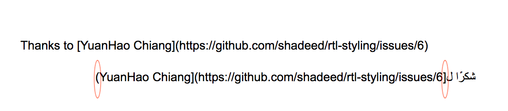

من مقالة "[نصائح لكتابة عربية أفصح](https://itwadi.com/node/2719 "نصائح لكتابة عربية أفصح")" للأستاذ عبداللطيف ايمش نقتبس:

> «يجدر بالذكر أنه من الضروري ضبط اتجاه النص عند ورود جملة أجنبية ضمن جملة عربية. فتظهر الجملة الأجنبية من اليمين إلى اليسار؛ لكن الصحيح هو أن تظهر من اليسار إلى اليمين كما في العبارة الآتية: "... وإعادة التوجيه إلى /dev/null"، فالصحيح هو كتابة العبارة كالآتي: "... وإعادة التوجيه إلى ‎/dev/null". القيام بذلك سهل جدًا، وذلك باستخدام محرف خاص من محارف اليونيكود يجعل الكلمة التي تليه تظهر من اليسار إلى اليمين ويُسمى LRM (اختصار للعبارة Left-to-Right Mark) الذي يُمكن إدراجه في "المفكرة" في نظام وِندوز، أو "gedit" في نظام لينُكس (وغيرهما من البرامج)، وذلك بالنقر بواسطة الزر الأيمن للفأرة ثم "Insert Unicode Control Character" ثم اختيار LRM. وكذلك الأمر بالنسبة لضبط اتجاه النص العربي (من اليمين إلى اليسار) في نص أجنبي (من اليسار إلى اليمين)، لكن عليك اختيار RLM بدلًا من LRM. »

وهذا الاقتباس في هذه المقالة من الأجزاء النادرة جدًا التي تحدثت عن حل لهذه المشكلة التي يواجهها كل من يكتب باللغتين معًا: العربية وأي لغة لاتينية أخرى..

وهنا سأضيف حيلة علمنيها الأستاذ عبداللطيف ايمش أثناء ترجمتي لصالح حسوب سابقًا، وهي تصلح لكل ما يكتب في المتصفح واستخدمتها كثيرًا في الكتابة على مستندات جوجل.

والطريقة كالتالي:

1\.     فتح الكونسول (console) للمتصفح، ويكون اختصار لوحة المفاتيح في أجهزة ويندوز: (command + shift + I) وفي أجهزة ماك: (command + option + J).

2\.     نسخ محرف RTL عندما تريد وجود سياق عربي يقتحمه نص إنجليزي وهو copy("\u200F")  أو نسخ محرف LTR عندما تريد وجود سياق إنجليزي يقتحمه نص عربي وهو copy("\u200E").

3\.     ثم النقر على Enter في لوحة المفاتيح.

4\.     ثم الصق في المكان الذي تريد تعديل اتجاهه.

وسأذكر مثالًا واقعيًا واجهته:

في الصورة أدناه ترجمة لشكر الكاتب لأحد الناس، وبما أن أسلوب الكتابة بأسلوب [ماركداون](https://academy.hsoub.com/apps/productivity/%D9%83%D9%8A%D9%81-%D8%AA%D9%83%D8%AA%D8%A8-%D8%A8%D8%B5%D9%8A%D8%BA%D8%A9-%D9%85%D8%A7%D8%B1%D9%83%D8%AF%D8%A7%D9%88%D9%86-%D8%A8%D8%A8%D8%B3%D8%A7%D8%B7%D8%A9-r290/)، فلكتابة رابط معين يجب أن يكون الاسم بين القوسين المربعين []، والروابط تكون بين القوسين ().فتكون كما يبدو هذا الشكل الذي أمامنا: [النص الظاهر]\([https://site.com/](https://site.com/)).

لكنك ستجد في الصورة أدناه، هناك اختلاف في الأقواس بسبب اختلاف المحارف في النسخة العربية.

والحل لهذه المشكلة يكون بتطبيق الخطوات التي ذكرتها سابقًا:

1. فتح الكونسول (console) للمتصفح.

2. سننسخ محرف RTL وهوcopy("u200F") . ثم ننقر على Enter. لا تقلق من القيمة الراجعة: undefined.

.3 الآن سنلصق المحرف في المكان الذي نريد تصحيح اتجاهه، وسيكون ذلك في المكان المدوّر بين نهاية القوس المربع والقوس العادي كما هو موضح في الصورة.

 

4. سنرى الآن تصحيح التنسيق!

وهكذا يمكنك تصحيح اتجاه المحارف.. وأحيانا قد تضطر للصق المحرف في أكثر من مكان حتى تضبط معك :).

تذكر أن هذه الطريقة لا تصلح في مستندات جوجل فقط، بل في أي إدخال نصي على الويب..

وهذا فيديو يشرح الموضوع: [رفعته بنفسي وأعتذر عن سوء جودته!](https://youtu.be/aV1Bh9Jnuz4)

 وأدعوك وبشدة إذا كان هناك أي تعليق أو إضافة أن تشاركها كي تعم الاستفادة للقراء الأعزاء ولي شخصيا.. وإذا كان هناك أمر غير مفهوم فأخبرني من أجل توضيحه..