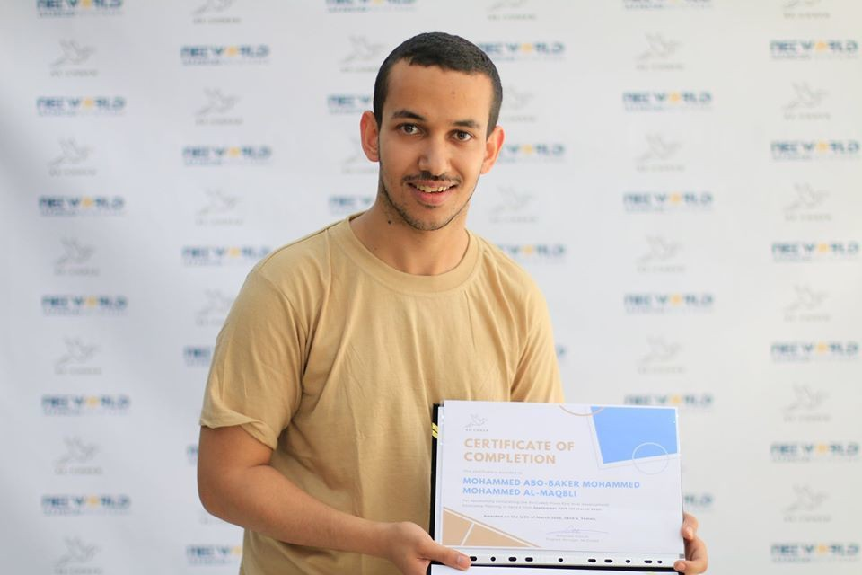

بداية..

السلام عليكم ورحمة الله وبركاته، أهلًا وسهلًا بكم. بين الحين والآخر سأعمل حوارات ولقاءات مع بعض الأصدقاء. سيكون الأمر تلقائيًا بحسب الحاجة..

في الفترة الماضية، حاورت أحد أصدقائي وزملائي في الجامعة، المبرمج الألمعي: محمد المقبلي. الذي تغلّب على الإعاقة، وكان من أفضل الطلاب في المستوى العلمي والأخلاقي، وكان يجيد الإنجليزية بطلاقة كمتحدثي الإنجليزية الأصليين.

حصل محمد المقبلي على منحة ريكودد، وهي أشبه مخيم تدريب (Bootcamp) للبرمجة يساعد الخريجين على التأهل لمستوى سوق العمل. توجد ريكودد في تركيا والعراق ودول أخرى، وفي هذه السنة بدأت التجربة في اليمن. سيحدثنا محمد عن نفسه وعن المخيم والتدريبي وأشياء أخرى، وأحب أن أبارك له بخصوص أنه جاء في المركز الأول في دفعته.

****

**أولًا، حدثنا عن نفسك، من أنت؟ وما علاقتك بالحاسوب والبرمجة؟**

محمد أبوبكر، خريج جامعة صنعاء كلية الحاسوب قسم تكنولوجيا المعلومات. محب للتكنولوجيا بشكل عام، والحاسوب خصيصًا منذ الصغر.

كانت ألعاب الحاسوب هي أول ما جذب انتباهي إلى الحاسوب فبدأت بالبحث عن مصادر هذه الألعاب وعرفت أنها عبارة عن برمجيات، وهذه كانت بداية الرحلة في عالم البرمجة.

**كيف كانت تجربتك في مخيّم ريكودد؟**

كانت تجربتي في مخيم ريكودد هي من أفضل التجارب التي مررت بها في حياتي، فقد اكتسبت من خلالها مهارات برمجية كثيرة. كان أولها التفكير كمبرمج وأيضا استخدام أدوات برمجيه تساعد في تنظيم وتسريع العمل. هذا بالإضافة إلى تعلم تقنيات الويب الحديثة من منهج متجدد ومتكامل.

**أذكُر أنني تقدمت لريكودد ولم أنجح، هل تعلم في السبب في قبولك أول مرة؟**

لا أعلم سبب قبولي، ولكن عملية التسجيل كانت عبارة عن أربع مراحل وهي

1\.  استمارة تسجيل عن طريق قوقل فورم و كانت عبارة عن أسئلة تعرّف بها عن نفسك.

2\. عبارة عن صفحتين ويب تحوي أخطاء بسيطة و المطلوب هو: أولًا قراءة مجموعة الدروس التي تم إرفاقها وثم تصحيح الأخطاء الموجودة.

3\.  اختبار تفكير وذكاء وهو عبارة عن مجموعة من الأسئلة التي تجيب عنها عن طريق قوقل فورم.

4\.  المقابلة الشخصية.

**تقريبًا كانت مدة المخيّم 4 أشهر، هل كانت كافية لتعلم تطوير الواجهات (Front-end)؟**

كانت مدة الخيم هي 5 أشهر ونصف وأنا أعتقد أنها كانت مدة كافية ففي هذه المدة لم نتعلم تقنية الويب فقط، ولكن تعلمنا مهارات كثيرة منها العمل كفريق، وتنظيم الوقت، وكيفية التواصل مع العميل وغيرها من المهارات. وكان سبب إضافة شهر ونصف إلى مدة المخيّم هو أنه في خلال شهر قام طلاب المخيّم بتصميم ثلاثة مواقع لثلاث شركات خارج اليمن.

**هل أصبح السوق اليمني ناضجًا بحيث يوظّف مبرمجي الواجهات فقط، وإذا لم يكن فما البدائل في رأيك؟**

من وجهة نظري ان السوق اليمني ليس ناضجا لتوظيف مبرمجي الواجهات ولكن البديل هو العمل عن بعد.

**تعلمتم في المخيّم مكتبة رياكت البرمجية لتطوير الواجهات، ما الذي يميّزها وماذا استفدت منها؟**

تتميز هذه المكتبة عن غيرها بأنها تسرّع الأداء، وتخفّف الضغط عن السيرفر، ففي حالة تغيّر أي مكون من مكونات الصفحة تقوم React بتحميله فقط وليس كل الصفحة. تتميز أيضا بأنها مشهورة مما يجعل من السهل جدًا الحصول على مصادر للتعلم.

**إذا كان هناك أحد يريد السؤال عن الأشياء التي سيستفيدها من ريكودد، ماذا تقول له، ما هي التقنيات التي استفدتها من ريكودد؟**

التقنيات التي تعلمتها في ريكودد هي:

1\.   Git & GitHub وهي من أهم الأدوات التي يستخدمها المبرمج في تسهيل وتنظيم عمله.

2\.   HTML.

3\.   CSS.

4\.   JavaScript، وهي واحده من اكثر اللغات توسعًا وتطورًا هذه الايام، حيث أصبحت تستخدم في تطوير جميع أنواع البرمجيات كالويب والأنظمة المكتبية وتطوير تطبيقات أندرويد وأيضًا تطبيقات الذكاء الاصطناعي والروبوتات.

**هناك مخيّمات مشابهة لريكودد، ما الذي يميزه ولماذا؟**

يختلف ريكودد عن غيره من المخيمات بأنه لا يشترط وجود خبره سابقة في مجال البرمجة لكي تلتحق بالمخيم، فالهدف من المخيم هو أن يكتسب الطالب مهاره التطوير الذاتي والبحث. إلى جانب مهارات تصميم الويب. فيستطيع الطالب بعد انتهاء المخيّم تعلم لغات برمجية أخرى بسهولة جدًا.

**كيف كان الجو الدراسي في ريكودد، هل كان محفزًا؟**

كان الجو الدراسي مشوقًا جدًا فقد كان مليء بالحماس والتعاون مما يحفّز الطلاب على بذل جهد أكثر في التعلم.

**هل حققت هدفك من هذا المخيّم؟**

نعم، حققت هدفي في هذا المخيم. فقد طورت من مهارات واكتسبت مهارات جديدة والأهم هو انه ازدادت ثقتي بنفسي بشكل كبير.

**عمومًا، هل تنصح بهذا المخيم؟**

أنصح كل من تسنح له الفرصة أن يكون جزءًا من مخيم ريكودد أن لا يضيّعه أبدًا.

**ما الخطوة القادمة في حياتك المهنية؟**

الخطوة القادمة إن شاء الله، هي أن تكون لي أعمال يستخدمها الناس لتسهيل حياتهم اليومية.

**من الأمور المهمة الذي أريدها في هذا الحوار وغيره من الحوارات، هي التنويه بمن أحاورهم والترويج لصلاحيتهم للعمل (الحر- عن بعد). كيف يصل القارئ إليك ويرى أعمالك وسيرتك الذاتية؟**

يمكن للقارئ التواصل معي عن طريق حسابي في [LinkedIn](https://www.linkedin.com/in/mohammed-al-maqbli/ "حساب محمد على لينكدن"). وأيضًا حسابي في [GitHub](https://github.com/MohammedAlMaqbli "حساب محمد على جت هب").

**هناك دفعة ثانية في ريكودد من بينهم صديقنا عبداللطيف، ما النصائح التي توجهها لهم للخروج بأكبر قدر من الفائدة من هذا المخيّم؟**

أنصح الدفعة الثانية من الطلاب بالاستفادة من الوقت في الفصل الدراسي، وذلك من خلال تحضير الدرس قبل موعد الفصل لكي يتمكن من طرح الأسئلة ويستفيد هو وغيره من الطلاب.

**لمن لم تتسنى له هذه الفرصة للولوج إلى مخيم كهذا، بماذا تنصحه؟**

أنصح أي شخص يريد تعلم البرمجة بالاستفادة من الدروس الموجودة بكثرة في النت. وأيضًا التركيز على لغة أو مجال محدد وإتقانه وعدم التشتت في عدة مجالات.

**من المعلوم معرفتك الممتازة باللغة الإنجليزية. ما مدى مساعدة هذه المهارة في رحلتك البرمجية؟**

ساعدتني اللغة الإنجليزية بشكل كبير في تعلم البرمجة، وذلك لوجود ثروة معلوماتية كبيرة ومجانية في مجال البرمجة على النت وهي في تطور مستمر، فمن السهل جدًا العثور على أي معلومات تريد تعلمها بالإنجليزية.

**ما الذي تنصحه للمبرمجين المبتدئين؟**

أنصح المبرمج المبتدئ بالصبر والمثابرة على التعلم، عدم الخوف من الخطأ، والتركيز على لغة واحدة في البداية لكيلا يتشتت فإن التشتت يؤدي إلى الضياع.

انتهى الحوار مع صديقي محمد المقبلي. أرجو أن تعجبكم هذه الفكرة، وأن تتواصلوا مع محمد لأي مشروع في برمجة الواجهات...

وإذا كان هناك أي تعليق أو فكرة، لا تترددوا بكتابتها في التعليقات أو التواصل معي..

أُخذت صورة محمد من صفحة [recoded](https://www.facebook.com/recodedofficial/posts/2892164384175202 "صفحة ريكودد على فيس بوك") على فيس بوك. وهذا [موقع ريكودد](https://www.re-coded.com/ "موقع ريكودد الرسمي") الرسمي.

مع السلامة..