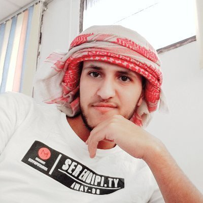
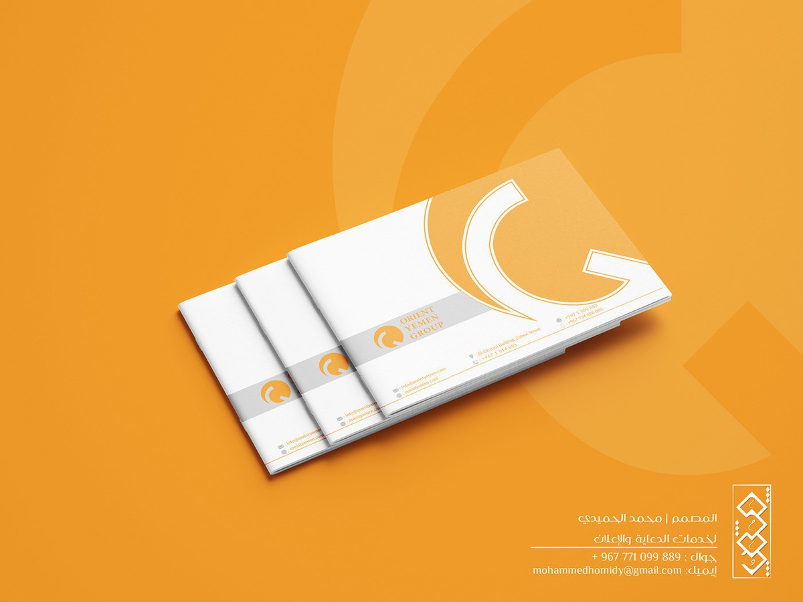
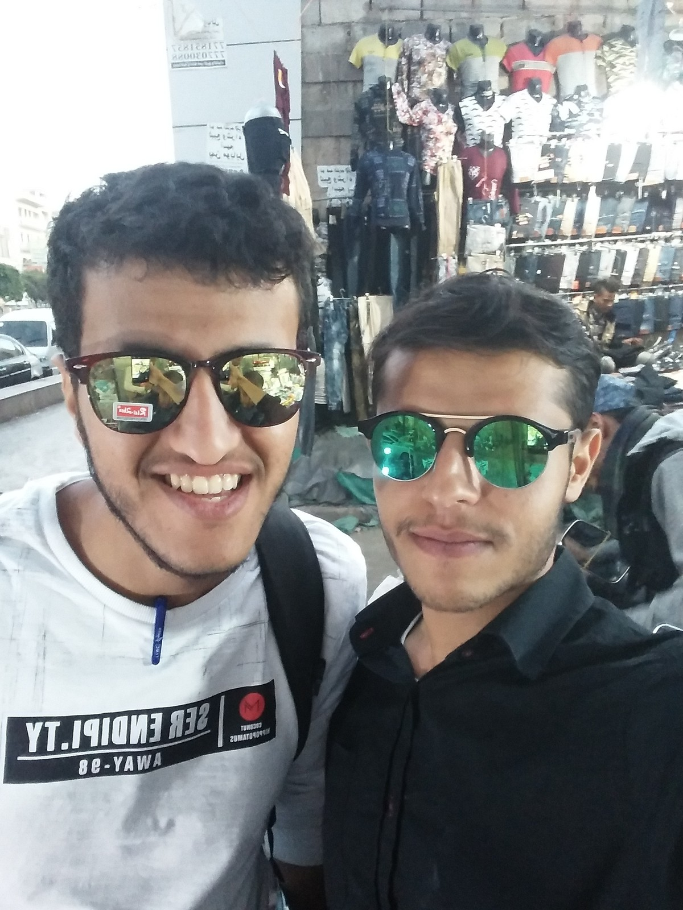
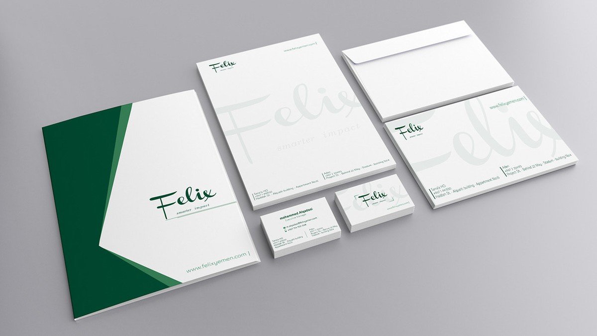
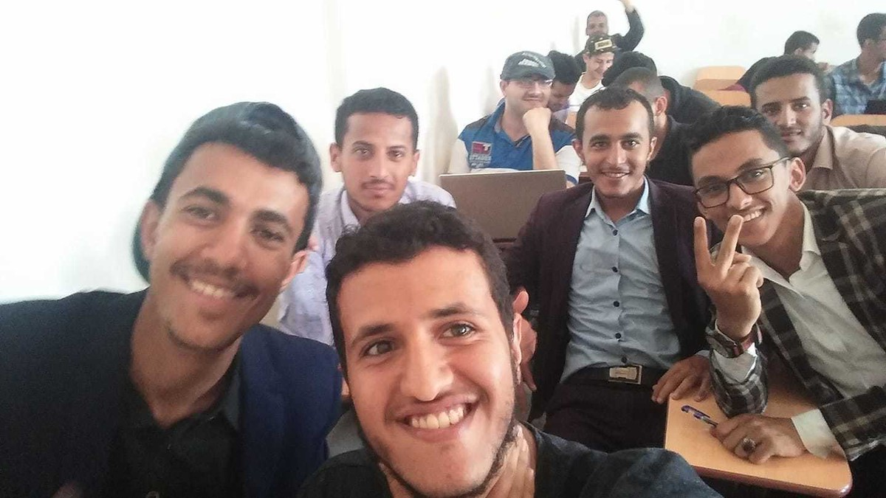
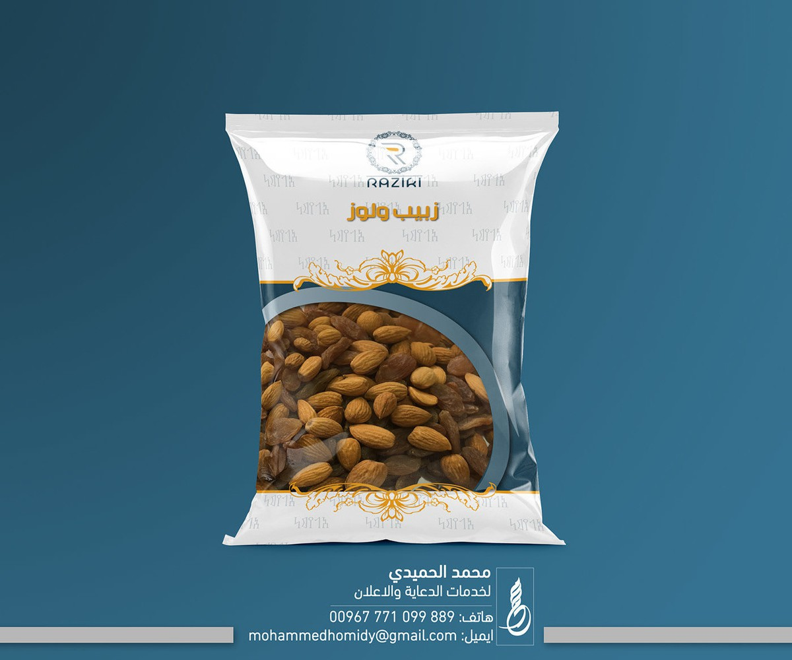
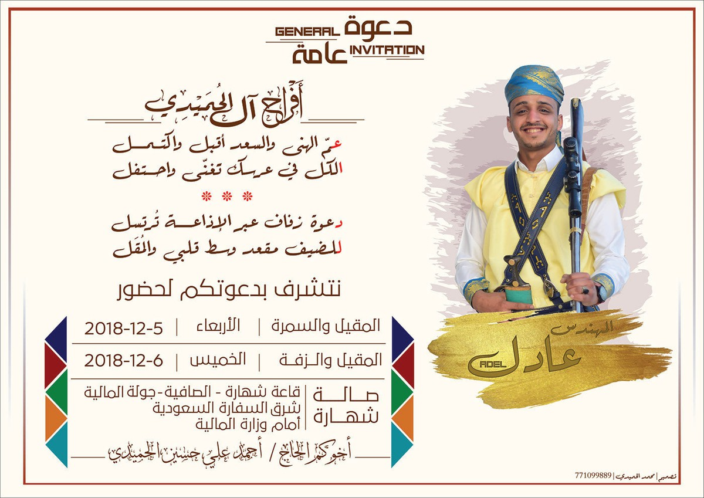
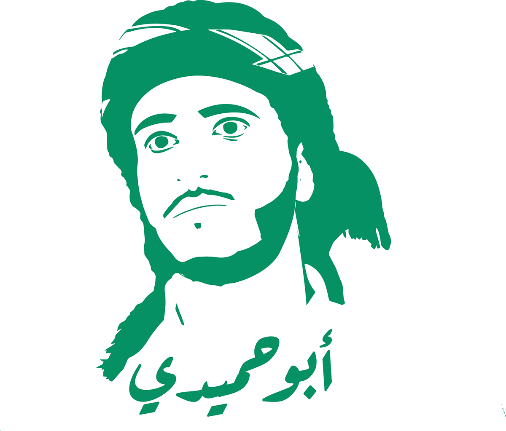

تحاورت قبل فترة مع صديقي وزميلي في الجامعة [محمد المقبلي](حوار-1-مع-صديقي-المبرمج-محمد-المقبلي-عنه-وعن-ريكودد-وأشياء-أخرى)، والآن أجري حوارًا مع أحد أعز الأصدقاء والزملاء الجامعيين: محمد الحميدي، وقد التحق بعد الجامعة بمخيّم (رواد) في تجربة تشبه تجربة محمد المقبلي مع بعض الفوارق..

إليكم الحوار.. سأعرض بين الأسئلة مجموعة من أعمال محمد بالإضافة إلى بعض الصور له.

«صورته الشخصية»

### حدثنا عن نفسك، وما علاقتك بالحاسوب؟ 

بسم الله والصلاة والسلام على رسول الله وآله وصحبه ومن والاه، وبعد، اسمي محمد عبدالله الحميدي، يمني الجنسية، من مواليد 1996 مديرية شهارة - عمران، بكالوريوس تقنية معلومات جامعة صنعاء لعام 2019.

قبل دخولي الجامعة لم أكن من هواة الحاسب الآلي والتقنية بشكل عام، ولكن شاءت أقدار الله بأن ألتحق بكلية الحاسوب، ومن هنا بدأ مشواري في مجال التقنية، وشغفي في تعلم التقنية يتطور مع تطورها وظهور كل ما هو جديد في هذا المجال، فأصبحت علاقتي مع الحاسوب علاقة طردية، فكلما زاد فهمي للحاسوب وما يصاحبه من تقنيات زاد احتياجي له.

### كيف تقيم تجربتك في مخيم رواد*؟  

سأقيم تجربتي لمخيّم (رواد) بشكل نثري وليس كما يتم تقييم المطاعم أو الفنادق (سمايلي فيس)، وأقول فيها كما قال الشيخ سلمان العودة عن السجون "تجربة رائعة أتمنى ألا تتكرر"...

أسباب أنها رائعة:

-   يعرّفك على أناس ذوي خبرات في مجال التقنية والويب بالتحديد - لأن المخيّم كان لتعلّم تطوير مواقع الويب.
-   (البيئة الفيزيائية)، من فصول مرتبة ومن شبكة إنترنت سريعة للمخيّم مساعدة جداً في التعلم والعمل.

أسباب أني أتمنّى أّلا تتكرر:

-   ما وجدته في المخيم كان أقل من مستوى ما قيل في الإعلان عن هذا المخيم قبل انطلاقه (أقصد به الخطّة التعليمية).
-   كانت فترة المخيّم التي تم الاتفاق عليها طويلة جدّاً ومع ذلك مكثنا في المخيم أطول من ذلك.
-   وجود تقصير من قبل الكادر المسؤول عن المخيم أتمنى ألّا يتكرر في المخيّمات المقبلة.

*ملاحظة جانبية للقراء وليست ضمن الإجابة: رواد هي مؤسسة يمنية لا ربحية تدهف لدعم ريادة الأعمال في اليمن. [موقع المؤسسة](http://www.rowad.org/)، وصفحتة المؤسسة على [فيس بوك](https://www.facebook.com/ROWAD.Foundation/).

<a href="https://www.behance.net/gallery/89560355/Orient-Yemen-Company-Profile-">Orient Yemen Company Profile تقرير لشركة اورينت يمن</a>

### هل يمكن أن تذكر سبب قبولك في مخيّم (رواد) من بين المتقدمين؟

سبب قبولي في هذا المخيّم -حسب علمي- أنني اجتزت اختبار القدرات التقنية في الويب والمقابلة الشخصية.

### كانت مدة المخيم تقريبا ٦ أشهر لست ساعات يوميًا ودرستم برمجة الواجهات وبرمجة السيرفر.. هل كان ذلك كافيًا؟

كان المفروض أن يكون كافياً مؤهّلاً لك في المنافسة في سوق العمل لو تم السير حسب الخطة الدراسية، بلغة الارقام والنسبة المئوية تستطيع أن تقول كان كافياً بنسبة 65%.

«عندما كنت مع محمد، وتتهافت علينا شركات النظارات للدعاية والإعلان ونحن بالكاد نقبل :)»

### هل يمكنك ذكر التقنيات التي تعلمتموها في المخيم؟ 

سأذكر كافة التقنيات التي تعلمناها، منها ما درسناه، ومنها ما مررنا عليه مرور الكرام: HTML, CSS, JS, Bootstrap, Node.JS, PHP, MySQL,NoSQL, WordPress, Laravel.

### ماذا عن الجو الدراسي للمخيم؟ 

الجو الدراسي رائع جداً جداً جداً ومحفّز للتعلّم وللعمل كما ذكرت بداية المقابلة.

<a href="https://www.behance.net/gallery/83544677/Visual-Identity%28-%29">Visual Identity(هوية بصرية لشركة فيلكس)</a>

### ما الخطوة القادمة في حياتك المهنية؟ 

العمل في تطوير مواقع الويب سواء كعمل حر أو لدى شركة وكما قيل "أنت تريد وأنا أريد والله يفعل ما يريد".

### كيف يصل إليك القارئ ويرى أعمالك؟ 

أنا -وأعوذ بالله من كلمة أنا- أداوم على نشر أعمالي في مجال الويب على حسابي في Github وكذلك أعمالي في مجال الجرافيكس في حساباتي على السوشيال ميديا بالذات حاسبي على Behance.

### نصيحة عامة توجهها لطالب سنة أولى، ولخريج جامعي.. 

لطلاب سنة أولى:

حاول أن تجد نفسك في مجال محدد من مجالات التقنية -فهي كثيرة جداً- وأن تطوّر نفسك فيه فهو مستقبلك المهني، ودعك من هوس التجميع لدرجات المواد فهي تحصر العقل في حدود المنهج وتثبّط العزيمة حال انتهاء الترم الدراسي.

للخريجين:

جد لك عمل في أسرع وقت ممكن -يحبذ أن يكون هذا العمل بفترة دوام معقولة- فمن العمل ستتعلم وتطور مهاراتك وكذلك استغل أوقات الفراغ في تطوير الذات واهتم باللغة الإنجليزية فهي لغة العالم، واعلم أن تخرّجك من الجامعة

ليس سوى نقطة البداية لفهم العلاقة الحقيقة بين تخصصك وسوق العمل الحالي، وهنا تكمن متعة التعلم لأنك ستتعلم أشياء تجد ثمارها في وقت قريب.

«صورة لأحد أواخر المحاضرات الدراسية»

### لو عاد بك الزمن، ما الذي كنت ستفعله بخصوص  البرمجة والتصميم وهذه الأمور؟ 

كنت سأتعلمها وأصل فيها لمراحل متقدّمة منذ كنت في بداية مشواري الجامعي.

### خبّرنا عن تجربتك في التصميم، كيف تعلمته؟ ما الفرق في رأيك بينه والبرمجة، هل ساعدك في رحلتك البرمجية أم أعاقك؟ 

تجربتي مع التصميم كانت منذ حوالي 3 سنوات من خلال متابعتي لكورسات على الإنترنت. مجال التصميم سهل جداً تعلّمه، ولكن يحتاج لذائقة فنيّة كي يبدع الشخص فيه. أجد الفرق بينه وبين البرمجة من خلال عقليات الأشخاص الذين يتعاملون معهما: فمن لديه ذائقة فنية وحس إبداعي من خلال تشكيل الأشكال وانتقاء الألوان والخطوط سيجد مجال التصميم أسهل من البرمجة، ومن كان عكس ذلك تجده يميل إلى البرمجة ويجدها أسهل من التصميم.

ساعدني التصميم في رحلتي البرمجية من حيث تصميم جزئية واجهة المواقع (front-end) وبشكل عام، فالعلم عبارة عن تسلسل من المعارف المترابطة من قريب أو من بعيد؛ فكلما زاد تعلّمك لعدة مجالات ستجدها مساندة لبعضها، ولكن عمر الانسان قصير فلا يضيّع وقته في التنقل بين مجالات التعلم وعليه الاهتمام والتعمّق في أفرع علمية قليلة وأن يبرز فيها.

<a href="https://www.behance.net/gallery/80350809/packaging-">packaging أكياس تغليف</a>

### كيف ترى العمل عن بعد بالنسبة للشباب اليمني؟

يدر مال أكثر من الشركات المحلية، ولكن عيبه أنه بطيء في تطوير مهارات الموظف -اليمني وغير اليمني- مقارنة بالعمل العادي، فهو لا يحتك مع أقرانه الموظّفين ذوي الخبرات. كذلك يوجد عيب آخر -هذا العيب يخصّ اليمني فقط- وهو ضعف الإنترنت في اليمن.

<a href="https://www.behance.net/gallery/73235953/_">دعوة زفاف</a>

### كيف ترى السوق البرمجي في اليمن؟

في تطور والحمد لله -ولكن بشكل بطيء بسبب الأحداث الحاصلة في البلد- وهذا التطوّر لا مناص منه، فتطور التقنية بشكل عام تجبر السوق البرمجي بأن يواكبها سواءً في اليمن او أي دولة أخرى.

### ماذا عن الذين لم يتمكنوا الولوج لمثل هذه المخيمات، بماذا تنصحهم؟

أن يشحذوا الهمم وأن يتعلموا في منازلهم، فهم يستطيعون التعلم في وقت أقصر بكثير من فترة المخيّم التدريبي وبذلك يوفرون وقت وجهد.

«تصميم صورته عن طريق إليستريتور»

### نعرف أن اليمن يعيش أوضاع صعبة جدًا، هل ترى في التقنية مخرجا للشباب اليمني وكيف؟

الحاسوب وما يقدمه من خدمات تقنية وغيرها من خدمات، مثل التسويق أو المزايدات في الاسواق الالكترونية وغيرها، يعتبر مخرجاً سهل، وناجح للشباب اليمني، وغيره من الشباب، ولكن يحتاج للعمود الفقري الذي لا يقيم صلبه إلا به. ما هو هذا العمود الفقري؟ العمود الفقري للتقنية في اليمن أو أي بلد هو الإنترنت، حال توفره بشكل جيد فلن يكون هناك أي عائق لأي شاب من العمل عن بعد أو المتاجرة عبر الإنترنت أو التعلم وغيرها من المجالات.

### أخبرنا بالتفصيل عن آلية عملك في التصميم من التواصل مع العميل إلى استلام الأموال..

عندما يصلني طلب تصميم من عميل أقوم بأخذ متطلبات التصميم من العميل بالتفصيل، وبعد فهم متطلباته أقوم بعرض سعر هذا التصميم للعميل، إذا تم الاتفاق على كل ما سبق، أطلب من العميل إرسال نصف مبلغ التصميم كعربون لبدء العمل، وعند الانتهاء من التصميم أرسله إلى العميل فيقوم بمراجعته، وإذا في تعديلات يريدها العميل على التصميم، أقوم بإضافتها (تعديلات طفيفة)، ثم يرسل العميل بقية المبلغ وأرسل له التصميم النهائي.

### كيف تسوق لنفسك كمصمم أو مبرمج؟

عن طريق نشر أعمالي في مواقع التواصل الاجتماعي.

روابطي: 

<https://www.facebook.com/abo7midi>

<https://twitter.com/abo7midi>

<https://www.behance.net/abo7midi>

<https://www.linkedin.com/in/abo7midi>

<https://www.instagram.com/abo7midi>

<http://github.com/abo7midi> 

وهذا رقمي على [واتساب](https://wa.me/00967771099889)

### هل من كلمة توجهها أو نصيحة أو إجابة عن سؤال لم أسأله؟

تعلّم، وطوّر مهاراتك وابذل أسباب الرزق، والرازق الله، كتب مقادير العباد قبل خلق آدم، "ومن يتوكل على الله فهو حسبه"، "ومن يتق الله يجعل له مخرجا ويرزقه من حيث لا يحتسب".

انتهى حواري مع محمد الحميدي، آمل أن يكون الحوار قد نال استحسانكم وإذا أردتم تصميمًا أو تطويرًا لموقع ويب فلا تترددوا بالتواصل مع محمد. والسلام عليكم.