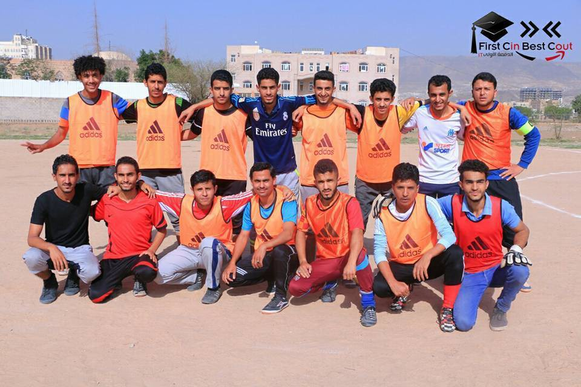
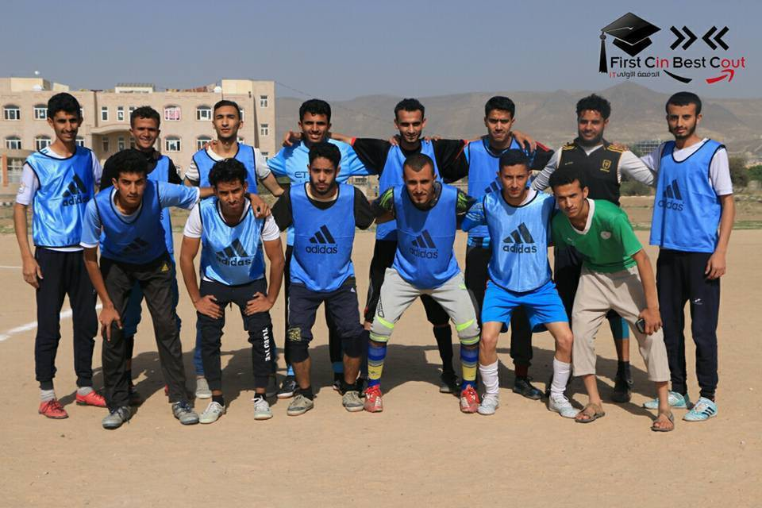
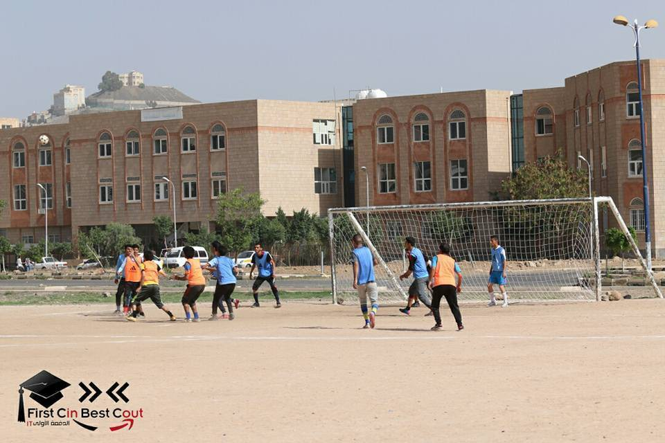
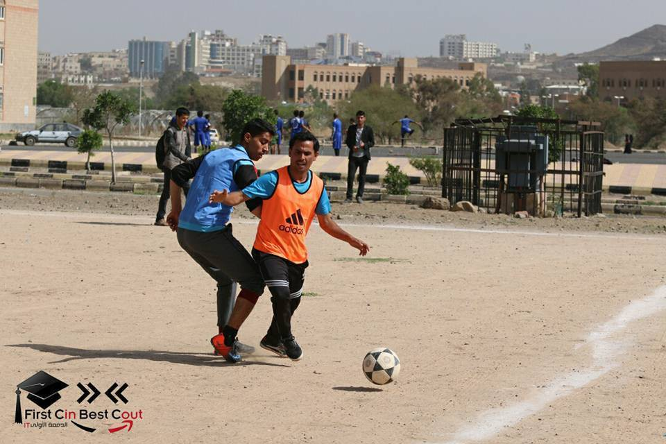
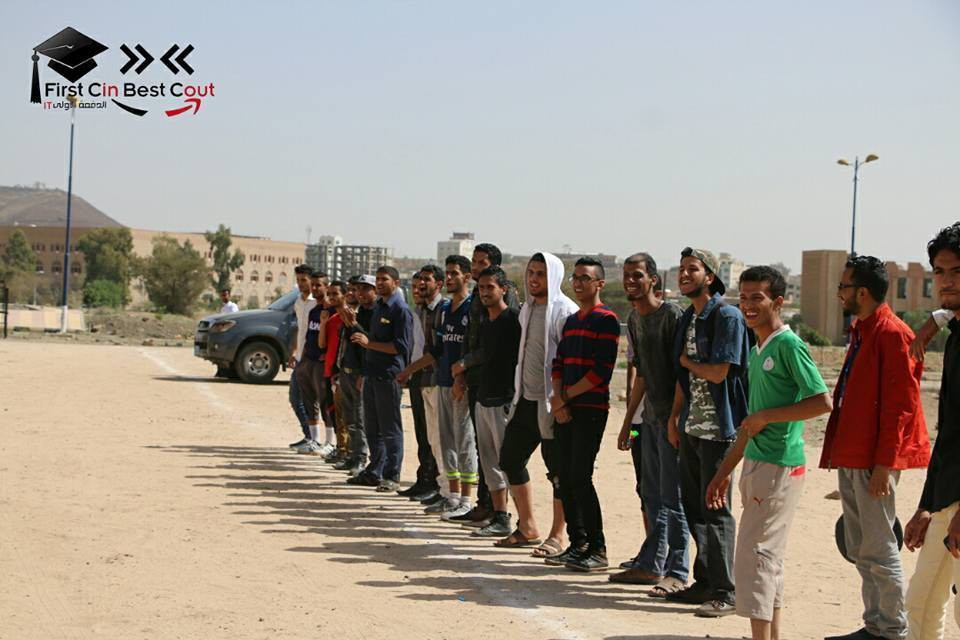
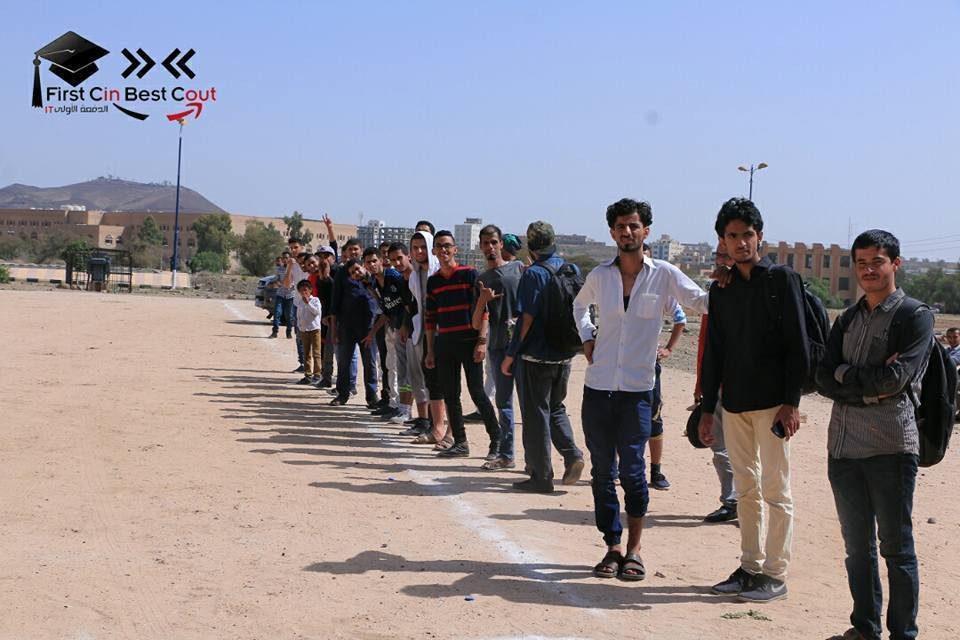

في  السنة الثالثة في الجامعة، أقيمت بطولة كروية  في كلية الحاسوب بجامعة صنعاء.. وصلنا إلى المباراة النهائية لملاقاة فريق (ملوك الحاسوب) وكان فريقنا يسمّى (الاتحاد). 

في الليلة التي سبقت المبارة النهائية كتبت هذه القصيدة متحديا فيها فريق ملوك الحاسوب ومتوعدا إياهم :)

* * * * *

ِاتّحدَتْ قُوتُنا يوماً ... وستبقى أَبَدَ الآباد

فالإتّي -تعلمُ ما الإتّي- ... عَلَمٌ في نارٍ ورمادِ

يَلْتَهِمُ الخَصمَ بلا مَهَلٍ ... يتحدَّى دوماً ويُنادي

شُهرتُه طارت آفاقاً ... في طارفِ أرضٍ وتلادِ

  أملوكُ الحاسوب أفيقوا ... والتمسوا الرحمةَ من (دادي)

لو وقَفوا كلَّ فريقَكُمُ  ... في المرمَى حُـرّاسُ أيادِي

سنمزّقُ شبّاك المرمى ... أهدافاً تَغدو كجرادِ

 فإذا واجَهْتُمْنَا فارضَوْا ... فخسارَتُكُمْ شَيْءٌ عادي

* * * * *

الطريف  في الموضوع أنه بعد هذا التهديد والوعيد خسرنا النهائي بهدف يتيم، وكما قيل "الصدق ينبئ عنك لا الوعيد".

وشكرا لضياء على هذا [المنشور الأسطوري](https://www.facebook.com/BestReturn.IT/posts/604878913310143)

وهذه بعض الصور: 

فريقنا (الاتحاد)

الفريق الخصم (ملوك الحاسوب)

وهذه لقطات أثناء المباراة 

 وهذا الجمهور المليوني :)  

