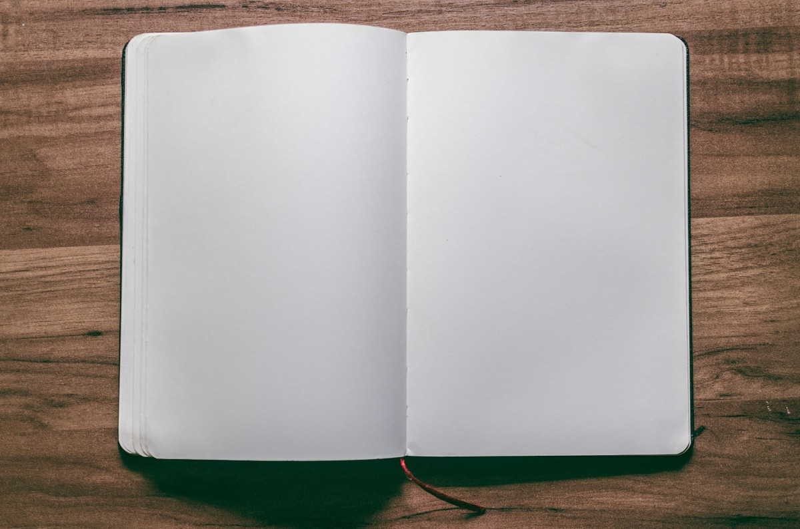

صفحة عادية، فقط، لم تتلطخ بالحبر، لا تحمل تصنيفاً، ولا يمكن أن تؤذي أحداً، ربما البعض يشعر بالارتياح تجاه هذه الورقة، فيما البعض تضيق الكلمات في جوفه بشكل خانق. يجب أن تتسخ هذه الورقة ومثيلاتها بالكلمات وتصبح من مجرد كيان مجرد خالٍ المعاني إلى أداة معرفة، ومن الحياد الذي لا يجدي إلى الانحياز الذي يحدث فرقا وترتقي في سلّمها الوظيفي لتصبح وثيقة، ومن يدري، ربما أصبحت كتاباً.

كلمات، شخبطات، إعادة تنسيق، خطأ مطبعي، ومراجعة لمعلومة، رسومات لا تحمل أي معنى، الكثير من الأشياء هنا وهناك. 

تأتي مقصلة  التحرير والتشذيب لتعيد الأمور إلى نصابها كشرطي يمسك بزمامها من الحروف المنزلقة والتعابير المارقة. 

الحكومات - وخاصة في بلادي- تحب الصفحات الفارغة، ليس نظافة أو جمالاً، ولكن الصفحات الفارغة تخبرها بخلو عقول أبناء هذا الوطن، وهذا هو المطلوب! 

وكما قال أحمد مطر: 

ـ اكتب لنا قصيدة

لا تزعج القيادة

( . . . . . . . . . )

ـ تسع نقاط ؟؟!

مالذي يدعوك للزيادة ؟

( . . . . . . . )

سبع نقاط ؟؟!

لم يزل شعرك فوق العادة

( . . . . . )

ـ خمس نقاط ؟؟!

عجباً !

هل تدعي البلادة ؟

( . )

ـ واحـــدة ؟!

عليك أن تحذف منها نقطة

احذف

فلا جدوى من الإسها ب والإعادة

( )

ـ أحسنت

هذا منتهى الإيجاز والإفادة !!

