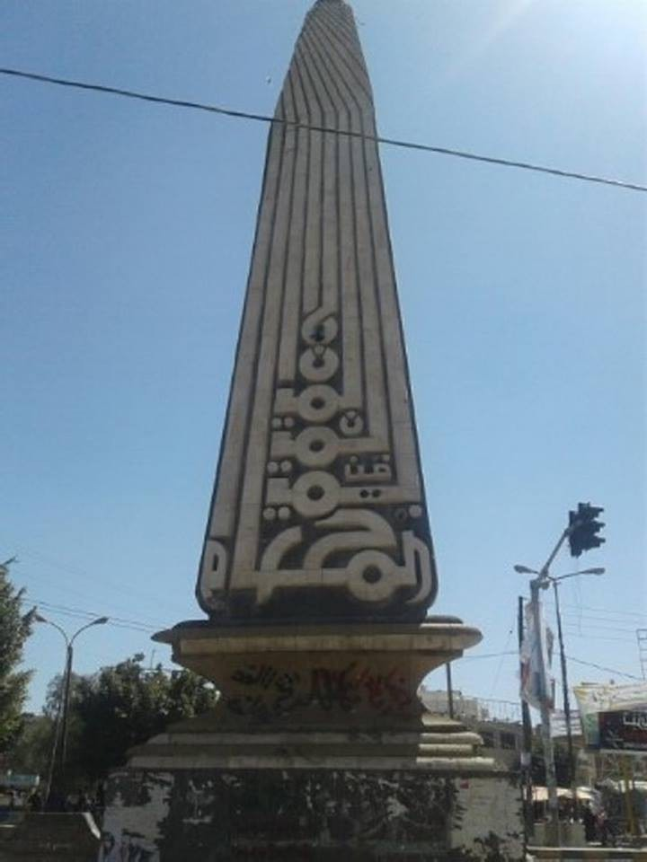

على جانب ساحة الجامعة والتي يقف فيها نصب "الإيمان يمان والحكمة يمانية"، وبَعد جولتين أو ثلاث من جولة (الكرامة)، المجزرة الوحيدة التي اعترف بها الجميع والتي لم يتبقى من شواهدها إلا صورة رثة شبه مطموسة بشهدائها. في تلك اللحظة ونظري ساهمٌ في الإيمان اليماني والحكمة اليمانية، وقفت شاخصاً. بدأت أتخيل ذلك المشهد العجائبي عندما امتلأت هذه الساحة بآلاف الشباب، والمنصة التي انطلقت منها تلك الأهازيج المدوية، والأناشيد الحماسية، والقنوات والصحف، والمستشفى الميداني، "وحيوا الفرقة حيوهم" والطموحات التي تناطح السحاب...\
هذه الساحة أدخل منها يومياً للولوج إلى الجامعة التي تزدحم بالطلاب، وعلى قارعة الرصيف أمرُّ بالباعة المتجولين، من بائع البطاط إلى بائع الكتب والمساويك والشراشف! الجميع يهتم باليوم، باليوم فقط، باختبار الدكتور الفلاني، أو بكمية الربح اليومي من جيوب الطلاب، وكأن شيئاً لم يكن. في الحقيقة حدث ما يمكن أن يكون أسوأ ما بالإمكان، وضع صعب ومعقد كالجملة السابقة. لم يتبقى من أبناء (الحكمة والإيمان) بيت مدر ولا وبر إلا وفيه شهيدٌ أو اثنين وسط كل هذا الغياب، وتحديداً، يصعب التأكد من شهادتهم جميعهم واستحقاقهم الآخرة كما ضاعت عليهم الدنيا، ومن تبقوا أحياءً ليسوا بأحسن منهم حالاً، بينما ألوية الغادرين ترتفع شاهقاتٍ إعلاناً لوفائهم المنقطع النظير! تجمعت الأكلة من كل فج عميق ولعقت هذا البلد المكلوم، لم يتركوا لنا شيء نتمسك به لأنه لم يعد شيء إلا خيبة الأمل.\
ولذلك، ولغير ذلك كثيراً، في كثير من المرات، أخرج من الباب الخلفي للجامعة، باب صغير جداً، بالكاد يتسع لفردين، لا يحمل تاريخ ممضاً، لا يحمل ذكريات مثيرة للأحزان، تخرج ناسياً ما قد مضى، منتظراً ذلك الباص الذي يصيح بأعلى صوته "الصافية - الرويشان". (أغلق هذا الباب فيما بعد).\
أما اليوم، في يوم جمعة من أيام الله التي ولحسن حظها لم تحمل اسماً كأخواتها الغاضبات والثائرات، في صباحٍ هادئ وعلى غير عادة تلك الساحة، وعلى بُعد مسافة قليلة من فرزة الباصات، وتحت منصة "الإيمان يمان والحكمة يمانية " ...\
هناك جلست فبكيت.

كتب لأول مرة في  19 / 11 / 2018

