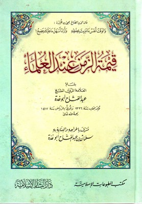

كنت أريد قراءة شيء ما يحفّزني لاستغلال الوقت استغلالاً أمثل مما أنا عليه، ووقعت على أحد هذه الكتب -بالصدفة- مثل كثير من قراءاتي، وقلت في نفسي: إن قراءة تراثنا خير من قراءة كتب التنمية السائدة والتي مللت من أحاديثها.

الكتاب صغير الحجم حيث يقع في ١٦٠ صفحة فقط، ويمكن قراءته بسهولة، والكاتب هو الشيخ عبدالفتاح أبو غدّة المعروف بتحقيقاته للحديث والتراث. وتحقيقاته أكثر بكثير من تآليفه، وقد كتب إلى جانب هذا الكتاب "قيمة الزمن عند العلماء" كتابيَن آخريَن لهما موضوع طريف كهذا وهما "العلماء العزاب"، و" صفحات من صبر العلماء"، وكلاهما يقعان فيما يقرب ١٥٠ صفحة.

يظهر في هذا الكتاب (نَفَس) الكاتب المحقق، فهو ينسب كل خبر إلى مورده وقد يحقق الخبر في الحواشي ويذكر الموضع أو المواضع التي أخذ منها هذا الخبر. وقد أكثر من الإفادة من مراجع في هذا الكتاب على صغره، وعني بدقة الاقتباسات، ويعيبها وجود العديد من العناوين داخل الاقتباس الواحد فيتشتت القارئ أثناء قراءته بتداخل العناوين. ونلاحظ أيضا العناية الفائقة بالتشكيلات وعدم لبس العبارة ودقتها.

أعجبني أن الكاتب لم يتعصّب لمذهب وإنما ذكر العلماء وطرفا من أخبارهم بغض النظر عن خلافاتهم ومذاهبهم، وإنما ركّز على أخبارهم الدالة على حرصهم الشديد على الوقت فيما قد يبدو مبالغة أو تشددا ولكن للعظماء مقاييس مختلفة و"على قدر أهل العزم تأتي العزائمُ."

يتكون الكتاب من ثلاث أقسام تقريبا: الأول وهو تذكير بأهمية الحفاظ على الوقت للجميع وعلى رأسهم طلاب العلم، والقسم الثاني: ذكر بعض الأخبار المحفزة للعلماء الدالة على حرصهم الشديد على الوقت سواء من أخبارهم أو من كثرة مؤلفاتهم أو مما نقل عنهم في أفعالهم وحبهم الشديد للعلم، حتى إن بعضهم يتدارس بعض الأحكام الفقهية وهو على فراش الموت!

وهذا السرد، سرد أخبار العلماء جاء مرتبا زمنيا بحسب وفاة العالم، وهو بهذا يعطى تصورا جميلا للزمن الذي عاش فيه هؤلاء العلماء وتعاقبهم، وهنا فائدة كبيرة للقارئ العادي غير المتخصص -مثلي- في التعرف على العديد من علماء هذه الأمة والجهد الذي بذلوه لخدمة هذا الدين.

 وينتهي الكتاب في قسمه الثالث والأخير، مثل ما ابتدأ به، بالحديث للقارئ بأهمية الحفاظ على الوقت الذي هو الحياة، وذكر اقتباسات جيدة في هذا الموضوع.

وفي آخر الكتاب يذكر جدول الآيات القرآنية والأحاديث والآثار والأشعار التي وردت في الكتاب، وهذا يعجبني عندما يكون في الكتاب عند مراجعته ومطالعته مرة أخرى وأخذ اقتباس معين.

ولا تنسى أيها القارئ أن تقرأ الصفحتين في آخر الكتاب ففيهما من الأشعار الرائقة والتي سجلها الكاتب أسوة بكتب التراث في كتابة الحكم والأشعار في أواخر الكتب وقيل أنّ هناك كتابا جمع فيه هذه الكلمات وهو المسمى "نزهة الخاطر، ونزهة الناظر، في أحسن ما نُقل من على ظهور الكتب والدفاتر".

رحم الله علماء الأمة المحمدية، وجعلنا متأسّينَ بهم ومحافظين على زماننا كما كانوا...

وهذه مجموعة من الاقتباسات التي استحسنتها الواردة في الكتاب:

    "والوقت أنفس ما عُنيت بحفظه.. وأراه أسهلَ ما عليك يضيعُ" --الوزير الصالح يحيى بن هبيرة 

    " أثقل الساعات علي: ساعة آكل فيها" --للخليل بن أحمد الفراهيدي

  " ليس لأحد أن ينسُب حرفاً يستحسنه من الكلام إلى رسول الله صلى الله عليه وسلم، وإن كان ذلك الكلام في نفسه حقاً، فإن كلَّ ما قاله الرسول صلى الله عليه وسلم حق، وليس كل ما هو حق قاله الرسول صلى الله عليه وسلم"" --الحافظ المزي الحلبي

 " إذا كتبت فقمِّش، وإذا حدثت ففتِّش" --ليحيى بن معين. وقمّش تعني اكتب كل ما تسمعه واجمعه.

  "كتاب العالم ولده المخلّد" -- ابن الجوزي

"أما بعد فإن خير ما قطع به الوقت، وشغلت به النفس، فتقرب به إلى الرب جلت عظمته: طلب علم أخرج من ظلمة الجهل إلى نور الشرع، وذلك الذي شغلت به نفسي، وقطعت به وقتي. فما أزال أعلق ما أستفيده من ألفاظ العلماء، ومن بطون الصحائف، ومن صيد الخواطر التي تنثرها المناظرات والمقابسات، في مجالس العلماء، ومجامع الفضلاء، طمعا في أن يعلق بي طرف من الفضل، أبعد به عن الجهل، لعلي أصل إلى بعض ما وصل إليه الرجال قبلي؟! ولو لم يكن من فائدته عاجلا إلا تنظيف الوقت عن الاشتغال برعونات الطباع، التي تنقطع بها أوقات الرعاع، لكفى، وعلى الله قصد السبيل، وهو حسبي ونعم الوكيل"   -- لابن عقيل الحنبلي

"وحدثني شيخنا - ابن تيمية - قال: ابتدأني مرض، فقال لي الطبيب: إن مطالعتك وكلامك في العلم يزيد المرض، فقلت له: لا أصبر على ذلك، وأنا أحاكمك إلى علمك، أليست النفس إذا فرحت وسرت قويت الطبيعة، فدفعت المرض، فقال: بلى، فقلت له: فإن نفسي تسر بالعلم، فتقوى به الطبيعة، فأجد راحة، فقال: هذا خارج عن علاجنا". --لابن القيم

وإذا طلبت العلم فاعلم أنه ... حِمْلٌ، فأبصر أي شيء تحملُ

وإذا علمت بأنه متفاضل ... فاشغل فؤادك بالذي هو أفضلُ

 -- لصالح بن عبدالقدوس

"اعلم أن رأيك لا يتسع لكل شيء، ففرغه للمهم. وأن مالك لا يغني الناس كلهم، فخص به أهل الحق. وأن كرامتك لا تطبق العامة - أي لا تعمهم وتتسع لهم -، فتوخّ بها أهل الفضل. وأن ليلك ونهارك لا يستوعبان حاجتك وإن دأبت فيهما، فأحسن قسمتهما بين عملك ودِعَتك من ذلك. "

     --العباس بن الحسن العلوي

قلت (أبو غدة): " كثيرا ما يزين لطالب العلم ويحلو له أيام الامتحان، قراءة العلم، الذي ليس مطالبا به في الاختبار، ويأتيه العزوف عن العلم المطالب به (المهم)، وهذا من مرض النفس وضعف الهمة والنشاط، فإن العلم المطالب به فيه تكليف وإلزام وتحمل وأداء، فهو ثقيل على النفس الوانية، والعلم غير المطالب به لا تكليف به، فهو خفيف على النفس، فليحذر العاقل الاستجابة لهوى نفسه، فإن هذا من سرقة الشيطان له وانحرافه به عن الصواب والمهم، والله الهادي."

" إذا ما علا المرء رام العلا ... ويقنع بالدون من كان دونا"

--جابر بن موسى الحنفي


"وما كل هاوٍ للجميل بفاعل .. ولا كل فعّال له بمتمّمِ" -- المتنبي

إذا كان رأس المال عمرك فاحترز ... عليه من الإنفاق في غير واجبِ

فبين اختلاف الليل والصبح معركً ...  يكرّ علينا جيشه بالعجائبِ

  --عمارة اليمني

إذا كان يؤذيك حر المصيف ... ويبس الخريف وبرد الشتا

ويلهيك حسن زمان الربيع  ... فأخذك للعلم قل لِي متى؟!

       --ابن فارس اللغوي

 أترجو أن تكون وأنت شيخ ... كما قد كنت أيام الشباب

لقد كذبتك نفسك ليس ثوب ... دريس كالجديد من الثياب

 -- الجاحظ. والثوب الدريس هو الثوب البالي الرث. 

" أَخْلِقْ بذي الصبر أن يحظى بحاجته ... ومدمن القرع للأبواب أن يلِجَا "

اليوم شيء وغدا مثله ... من نخب العلم التي تلتقطْ

يحصّل المرء بها حكمة ... وإنما السيل اجتماع النقطْ

       --بهاء الدين ابن النحاس الحلبي

دقات قلب المرء قائلة له: ... إن الحياة دقائق وثوان

فارفع لنفسك بعد موتك ذكرها ... فالذكر للإنسان عمر ثاني

--أحمد شوقي

أذان المرء حين الطفل يأتي  ...         وتأخير الصلاة إلى المماتِ

دليلٌ أن محياه يسيرٌ           ...           كما بين الأذان إلى الصلاةِ

"لو سكت من لا يعلم عما لا يعلم، لسقط الاختلاف" 

-- كلثوم بن عمرو العتاّبي

" أعقل الناس رجل أذنب ذنبا، فنصب ذلك الذنب بين عينيه، وبكى عليه حتى أورده الجنة، وأحمق الناس رجل أعجب بعمله، فنصبه بين عينيه حتى أورده النار." 

-- سفيان الثوري

"قالت لنا سودة الأهداب والمقلِ ... ليس التكحّل في العينين كالكَحَلِ"

"قصّوا عليّ حديث من قتل الهوى ... إنّ التأسّي روح كل حزينِ"

إن التشاغل بالدفاتر و المحا    بر والكتابة و الدراسة

أصل التعبّد و التزهّد          والرئاسة و الكياسة

" إذا بدأت بالإحسان تمّم ... وما الإحسان إلا بالتمامِ "

"نهاية آمالي لقاؤك مرة .. فيا ليت شعري هل يساعدني الدهرُ"

"ويوم لا أراك كألف شهرٍ .. وشهر لا أراك كألف عامِ"

ومن ألطف ما قيل في قهوة البن:

أنا المعشوقة السمرا   ...  وأُجلى في الفناجينِ

وعود الهند لي طِيبً ... وذِكري شاع في الصينِ

لدى العبّادِ لي قدْرً     ...   كذا عند السلاطينِ

كَيفَ الوصولُ إِلى سُعادٍ وَدونَها ... قُلَلُ الجِبالِ وَدونَهُنَّ حُتوفُ

وَالرَجلُ حافِيَةٌ وَلا لي مَركَبٌ ... وَالكَفُّ صِفرٌ وَالطَريقُ مَخوفُ

 -- الشافعي

"رأيت أخا الدنيا وإن كان ثاويا ... أخا سَفَرٍ يُسرى به وهْو لا يدري"