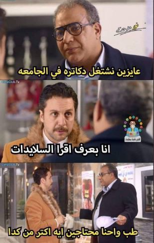

قررت قبيل أحد الاختبارات أن أغيّر طريقة مذاكرتي. دائما ما تأتيني الأفكار الغريبة والتقليعات عند الاختبارات، وتصبح شيئا ملحّا بالنسبة لي، مثل مرة قررت قراءة مجموعة من الروايات أثناء فترة الاختبارات. لنعد للفكرة الجديدة التي فكرت بها، وهي المذاكرة من الكتاب وليس شرائح العرض التقديمية slides، وإنما قررت فتح ال pdf والقراءة، مجرد القراءة، وأحسست لأول مرة بالفهم الحقيقي وترابط المعلومات ووصولها وصولا متكاملا جعلني أتذكر تلك الأيام التي كنت أفهم المواد جيدا. ربما قد تكون إنجليزيتي قد أسعفتني نوعا ما في قراءة المنهج المقرر، وبهذا أعود للمشكلة القديمة، والتي تغيظني جدا وهي تقرير الدراسة الجامعية باللغة الإنجليزية والتي أعارضها تماما لأنها سبيل العجز والكسل وأود أن أكتب لذلك مقالا مفصلا.

العروض التقديمية صنعت بالأساس وبالأول والأخير من أجل مساعدة صاحب العرض على تسهيل العرض، وعلى عمل تمثيل مرئي visualize للمفاهيم المجردة التي يلقيها على مسامع الحاضرين، وليس لشيء آخر، بالتأكيد ليس للمذاكرة، ولكن لأن المحاضرين يعلمون مدى ضعف الطلاب في اللغة الإنجليزية فيخففون عليهم المتطلب إلى العروض التقديمة فقط. وهذا شيء سيء لأنه يحرم الطلاب من العديد من المزايا ويجعلهم مجرد آلات حفظ المعلومات مجزأة وغير مترابطة منطقيا. إضافة إلى أنه يفقدهم القدرة على الاستيعاب من النصوص الطويلة وتحسين المهارات اللغوية والقدرة على استنباط وتحليل نصوص المَراجِع والمناهج المقررة وتشرّب معلوماتها ويحرمهم أيضا من التفكير النقدي والعلمي الذي تقدمه الكتب من خلال التمهيد وعرض المشكلة والمنهجية التي تتبعها وطريقة حل هذه المشكلة. إضافة إلى ذلك ضبابية المسار العلمي للطلاب إن لم يقرأوا الكتب فلا يعرفون كيف يطوروا أنفسهم بعد الجامعة إن لم يكونوا كارهين للقراءة وغير صبورين لقراءة الكثير من الكتب طوال حياتهم لأنهم غير متعودين على ذلك. وكفا من مصيبة أن يكون الجامعيون غير متآلفين مع الكتب والكتابة، فإن لم يكونوا فمن غيرهم؟!

نعم نحن نعيش في عصر المعلومات والفيديو أصبح في كل شيء لكن الكتب دائما هي الوسيلة الأفضل للحصول على معلومات عميقة ومتكاملة عن موضوع معين فحتى الدورات المقدمة من أرقى جامعات العالم تضع في المتطلبات مَراجِعا من الكتب تغطي المنهج وتكمله، وكل ما ارتقى الطالب في السلم الأكاديمي كلما قلّ احتياجه للمحاضر والمساعد وازداد اعتماده على نفسه وقدرته على القراءة والاستيعاب لوحده بدون مساعدة. احتياجه دائما لفيديو يشرح جزئية معينة هذا نقص في حق الطالب وضياع كبير لوقته وجهده.

ما الحل؟

في رأيي الحل يكون في:

1) أن تتغير المناهج إلى اللغة العربية يستطيع الطالب العادي قراءتها بدون صعوبة حيث أن المناهج الإنجليزية مرهقة للطالب لأنه يحتاج إلى ترجمة كل مرة مما يدفعه لترك القراءة. وإذا لم توجد مناهج عربية جيدة فيجب ترجمة أحد المراجع الإنجليزية الجيدة فمجموعة من الناس تبذل الجهد والبقية تكمل مسيرة التعليم والفائدة عامة.

2) عمل الاختبارات من المقررات وليس من العروض التقديمية مما يدفع الطلاب للقراءة مدفوعين بالدرجات حتى تصبح طبيعة وعادة في القراءة العلمية. هذا ما أقترحه حاليا، ولكن

ما رأيكم. هل من اقتراحات أخرى؟ نسيت أن أخبركم عن نتيجة اختباري في أول المقال.. آه.. لقد كان جيدا جدا وعلى كل حال كان الاختبار سهلا.

ملاحظة: إذا لم تكن من اليمن ولا تعرف سوء التعليم الجامعي فيها فعليك بقراءة "حديث السنين - سيرة ذاتية" للأديب إبراهيم السامرائي الذي عمل محاضرا في جامعة صنعاء، الجامعة التي درستُ فيها. عمل فيها السامرائي من عام 1987 - 1996. وذكر في كتابه من سوء التعليم في الجامعة من العجب العجاب. كان ذلك في العام 1995م والوضع الآن أسوأ بكثير على كافة النواحي وعلى رأسها التعليم.

كتاب حديث السنين أحتاج لقراءته متأنيا - خصوصا مرحلة اليمن- ومراجعته مراجعة مطولة وأرجو أن تكون قريبة.