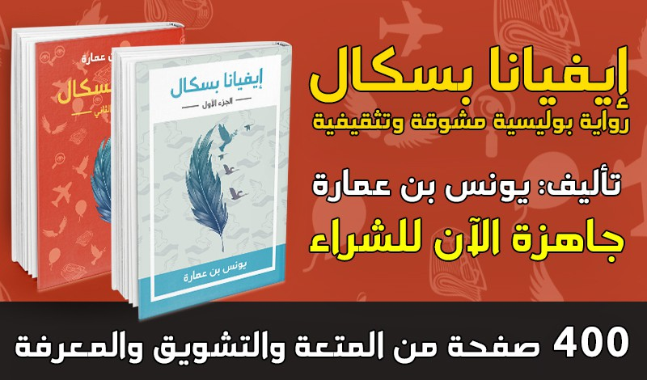
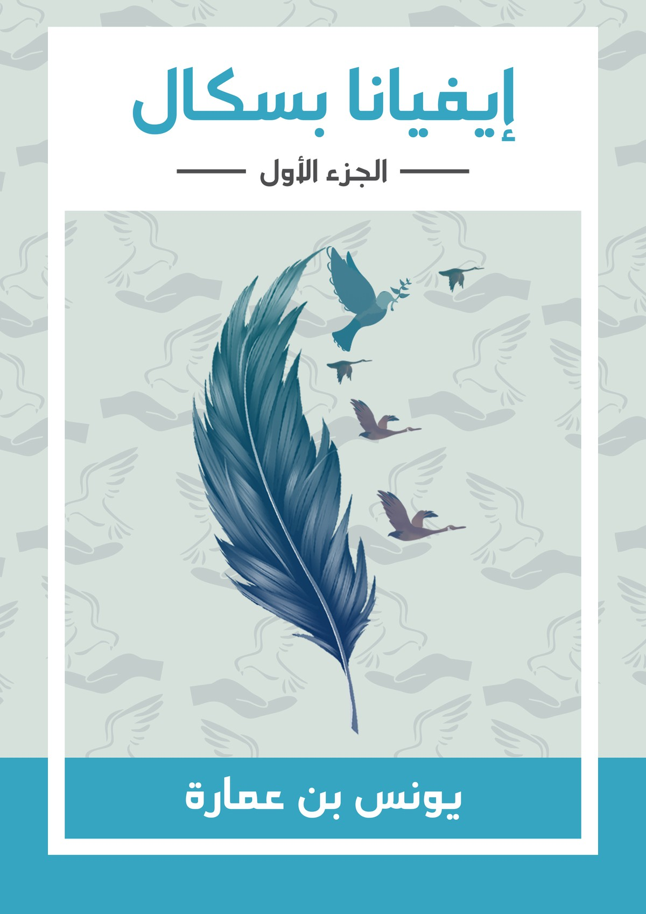
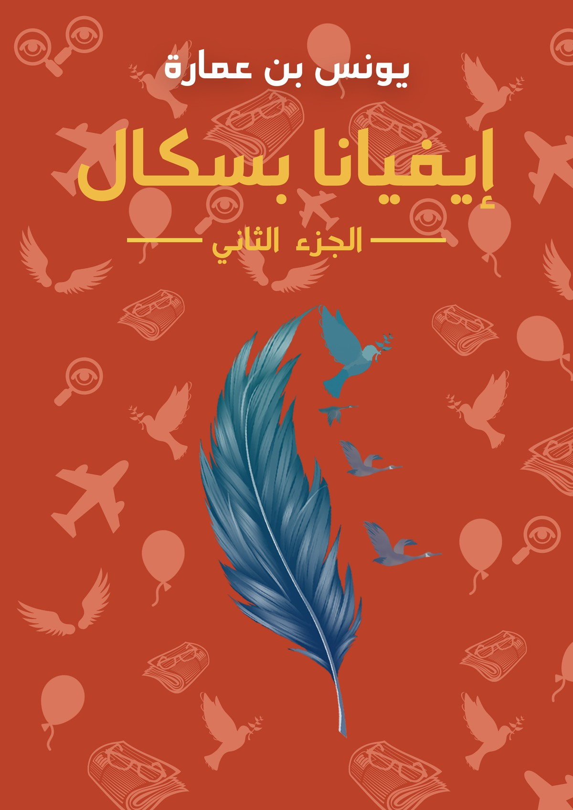

بسم الله الرحمن الرحيم.. 

كنت قبل فترة طويلة، كتبت مراجعة عن كل ما كتبه الصديق العزيز يونس بن عمارة، وأسميت تلك التدوينة "[كيف يكتب يونس بن عمارة](كيف-يكتب-يونس-بن-عمارة؟)"، تتبعت فيها كلما كتبه يونس منذ بداياته حتى تلك الفترة.

وكان آخر ما كتبه هي رواية "إيفيانا بسكال"، والتي تهممت بين فترة وأخرى أن[ أشتريها](https://youdo.blog/youarecool/) ولكنه تكرّم وأهداني إياها مجانًا.. فله جزيل الشكر.

بالمناسبة، أجد صعوبة في مراجعة الروايات، وأفضّل مراجعة الكتب الأخرى، تلك الكتب التي يُطلق عليها غير خيالية (non- fiction). تلك الكتب التي أستطيع أن أكتب عنها في سياق غير سردي، بحيث أقفز من أحد الفصول إلى الآخر جيئة وذهابًا وأناقش أفكار الكتاب عوضًا عن نقد الكتابة الفنية.

الرواية مقسمة إلى جزأين، أو لنقل أنهما روايتان يتشاركان نفس السمة السائدة، ونفس اسم الشخصية البطلة: "إيفيانا بسكال". بهذا المعنى، يمكنك قراءة أيًا من جزئي الرواية بدون الحاجة لقراءة الجزء الآخر..

هناك شيئان مهمان في انطباعي عن أي رواية أقرأها: أن أقرأها بسرعة بدون ملل، وأن أستشعر القصة وأتأثر بها.. وقد نلت منهما (المتعة والشعور) بنصيب أثناء قراءتي لهذه الرواية.

وهيا بنا نناقش الرواية بقدر أكبر، بطريقة لا تحرق الأحداث. على أنني لا أؤمن بفكرة "حرق الأحداث" بالصورة الطفولية المنتشرة حاليًا..

في الجزء الأول من الرواية تُقدم شخصيات الرواية بقدرٍ جيد، إيفيانا وزوجها وآخرون، وتسير الأحداث في تسلسل منطقي (والمنطق هنا هو منطق الرواية)، وتستمر الأحداث بمنعطفاتها وأثرها على الشخصيات بسلاسة وانسيابية ولغة فيها من الشاعرية ما يثير الإعجاب. لغة بسيطة وجميلة وليس فيها تقعر أوحذلقة مريبة..تتخلل الجزأين كلمات غاية في الرقة والعذوبة تشعرك بشاعرية المؤلف ورقة مشاعره المرهفة. وهذا شيء يحسب للرواية.

ولكن الشيء الذي لم يعجبني، إقحام إسلام بعض الشخصيات بصورة سهلة جدًا لا تمت بالواقعية بصلة، كان من المفترض تصوير المعاناة النفسية والصراع الداخلي للشخصيات والانقلاب الفكري الشامل الذي سببه الإسلام والتحول التام في ذوات الشخصيات ومحيطها، وما زاد هذا إتيان المسلمين الجدد بفتاوى وتقريرات دينية لا يقولها إلا من شاب رأسه في الإسلام..

والآن لننطلق إلى الجزء الثاني..

الجزء الثاني هو الجزء البوليسي، وفيه الحبكة مرسومة ببراعة، وفيه تعقيد وتشابك في الأحداث أكثر بكثير من الجزء الأول. تحدث فيه جريمة قتل غامضة، وتنطلق الأحداث المتعاقبة للتوصل إلى الجاني..

لم يعجبني في هذا الجزء كثرة الشخصيات وعدم تقديمها تقديمًا يعلق بذهن القارئ وشعوره. عرفت الآن أن الإسهاب في وصف بعض الشخصيات والمواقف، بطريقة قد يعتبرها القارئ المتسرع استعراضًا لغويًا وحشوًا لا طائل من ورائه. عرفت أن له وظيفة فنيّة أدبية ووظيفة أخرى تكتيكية بحيث (يصحب) القارئ شخصيات الرواية ويتعرف عليهم عن قرب؛ إذ كيف يتسنى للقارئ معايشة هذه الشخصيات معايشة مكثفة تنهمر على وجدان القارئ.

هذه المعايشة تأتي إما بالوصف المسهب لوجه الشخصية ونظراته وطريقته في الكلام والمشي وغيرها من الأمور حتى تتجسد الشخصية ماثلة أمام القارئ، وأما أن تأتي المعايشة عن طريق سرد الحوار بطريقة تنبئ عن عقلية الشخصية وطريقة تفكيرها، فهناك المتهور والطريف والحكيم والساذج، وإما أن تأتي بكليهما (التجسيد الوصفي) أو (التجسيد الحواري).

أجاد المؤلف شيئًا من التجسيد الحواري لبعض الشخصيات، ولكن كان من الضروري التجسيد الوصفي للشخصيات خصوصًا أنها أجنبية، وهذه ملاحظة مهمة: أن الشخصيات ذات الأسماء الأجنبية عن ثقافة القارئ تصبح عائقًا إضافيًا لتذكر هذه الشخصيات حتى تترسخ في الأذهان. للأسف، في خضم الرواية وجدتني أتوه ولا أعرف من هي الشخصية أو الشخصيات التي أقرأ لها. التقديم للشخصيات جميعها في بداية الجزأين كان جيدًا ولكنه غير كافٍ إطلاقًا للتعرف الحقيقي على الشخصيات، على أن نحبها أو نكرهها، على أن نقف معها أو ضدها، ولهذا نجد التأثر الأكبر يكون للشخصية الرئيسية في الروايات والأفلام لأننا عرفناها وصحبناها أكثر من غيرها.

وكذلك، كما في الجزء الأول، أُقحم السفر إلى سوريا بدون مسّوغ أدبي فني في نظري.. وكأنه جسم غريب زائد عن جسد الرواية ولا يقبل -في قراءتي- أن يتواءم معها، مثله مثل اعتناق الإسلام في الجزء الأول. 

نقد آخر، وهو يشمل كل كتابات الصديق يونس بن عمارة عمومًا، وهو الجمل الاعتراضية الموجهة للقارئ، وهذه الجمل جميلة وفيها طرافة وكسر للرتم الممل، لكنها كالملح في الطعام، زيادتها يضر أكثر مما ينفع. هي تشبه تحدث الممثل إلى الكاميرا خارجًا عن سياق المشهد. طبعًا في إيفيانا بسكال تخفف يونس منه كثيرًا مقارنة بكتاباته السابقة، لكنها ما زالت موجودة. هذا إلى جانب كثرة الشخصيات (في الجزء الثاني) وعدم تقديمهم بالطريقة الكافية مما أصابني بالتّوهان.

هناك بعض الأخطاء المطبعية التي يمكن إصلاحها بسهولة نظرًا لأن الرواية إلكترونية، وهذا شيء غير ذي بال في رأيي وفيه شفاعة أن الرواية غير صادرة من دار نشر تراعي هذه الأمور.

أخيرًا، أقول أن هذه الرواية بجزأيها جميلان، ويستحقان القراءة، [وأدعوكم لشرائها](https://youdo.blog/youarecool/) من خمسات أو غيرها من نقاط البيع. وعلى الرغم من نقدي القاسي إلا أنني أنقده على مستوى المؤلفين الكبار وأريد من هذه المراجعة التحسين والرفع بالمستوى وليس المداراة وأن أجامل هكذا، وهذا منبعه الحب الخالص والصداقة الصادقة..

وشكرًا يونس.. 

أترككم مع هذه الاقتباسات:

  "ألم أقل دومًا أن "الطبيب النفسي للزوج هو الزوجة!"

 ".. ولكن ألا تظنين عزيزتي أن ألسنة الناس تشكل سببًا رئيسيًا لتعاسة الأزواج؟

  - أجل.. ولذلك لن لنصغي لأحد.. 

  - من الأفضل أن تقولي: لن نصغي للنساء.. لأن النساء أطول خلق الله ألسنة!"

"إن الفنان الذي لا يريد أن تحتوي لوحته على أي خطأ، أخطأ مرتين: خطأ معنوي وخطأ مادي. 

الخطأ المعنوي: أنه يعتقد وجود المستحيل؛ الخطأ المادي: بسعيه إلى عدم وجود أخطاء سيقع في أخطاء ثانوية كثيرة. كان أستاذ الرياضيات دائمًا ما يقول لنا «التركيز الزائد حتما يؤول إلى عدم تركيز أبدا»."

"عندما يفتح التلفاز يجد الفلم يتكلم عن الزوج وزوجته.. القصص والروايات غالبًا تنتهي بالنهايات السعيدة عن زواج ناجح قصص الأطفال كذلك وتساءل جيروم: ترى لماذا نعتبر الزواج السعيد غاية المُنى؟"

"لم أفتح عيني إلا بعد مدة

وعندما فتحتها، سمعت صوتًا

فات الأوان

أيها الإنسان الأعمى الذي 

لا يرى إلا شهواته

ينسى إخوانه في البلاد الأخرى

ينسى الله وعقاب السماء

لم أفتح عيني بعد، وعندما 

أفتحها أعلم أني سأرى

كل ما تفعله الأيادي الآثمة 

الملطخة بالدماء 

التي لا تكتب أسماء أصحابها

في الدواوين الحمراء 

وإنما بجملة، بالقطيع الكامل

تدفنهم في حفرة واحدة ظلماء

لنقرأ ذلك في جرائد المساء

تحيك جدتي قميصا بنيا 

ليدفن أكبر عدد من الفقراء"

"الوحدة هل هي مرض نفسي؟

سأعالج في هذه المقالة موضوعًا عالجه من هو أكثر مني علمًا وأعز معرفة في كتب متسقة متوسعة، لكني لن أكتب اليوم مقالة بقدر ما أبدي رأيي الخاص، الوحدة في بعض الحالات تفهم خطأـ فمثلًا الغربة التي تقرب بالوحدة غالبًا، عندما تجد في الغربة أصدقاء وعملا وربما تتزوج وتنجب أطفالًا ويقول في بعض حالاته أنه وحيد فيما هو يحس بالغربة وهذه الحالة تأتي عندما يفشل طالب ما في حبه الأول بالأخص فهو يحس رغم وجود أصدقاء أنه وحيد فيما أنه هو مكتب وحسب، وهذا ما تحس به المرأة المطلقة والرجل المطلق والأرملة واليتيم وغير ذلك. هنا سوف يقول بعضهم: وما هي الوحدة إذن؟ الوحدة آتية من معناها اللغوي أن تكون وحيدًا ويعرفها النفسيون بأنها الحرمان من الدعم النفسي من الآخرين وهذا هو التعريف الذي أراخ للوحدة، فالوحيد هو الذي يعيش وسط مجتمع لا يسأل عنه، لا يهتم به، لا يرثى له لآلامه، لا يحتضن أحلامه، لا يهمه أمره البتة، هذا وفقط هو الوحيد وهو الذي يعاني الوحدة."