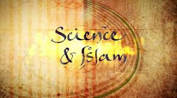

وثائقي جميل من BCC كعادتها. وهذا[ رابطه على imdb](https://www.imdb.com/title/tt1675198/). فيه تقديم لمحة عن التاريخ العلمي في الحضارة الإسلامية ومدى استفادة الأوروبيين والعلم الحديث منها. هذا الوثائقي مكوّن من ثلاثة أجزاء، سأرشّحه لأي واحد يريد معرفة هذه التراث العلمي الهائل أو شيء منه. ويمكنك ترشيح مقالي هذا إذا لم يتوفر لك الوثائقي.

مقدم الوثائقي "جيم الخليلي" Jim Al-Khalil من جامعة سُرري University Of Surrey، وهو عراقي من أم إنجليزية، هاجر إلى بريطانيا ومقيم فيها ويعمل  دكتورًا في الفيزياء هناك. في هذا الوثائقي تصوير ميداني في سوريا وتونس ومصر وإيران وإسبانيا.

الجزء الأول "لغة العلم"
-----------------------

حديث عن إشارة من قبل عالم الرياضيات الإيطالي "[فيبوناتشي](https://www.marefa.org/%D9%81%D9%8A%D8%A8%D9%88%D9%86%D8%A7%D8%AA%D8%B4%D9%8A)" لكتاب "حساب الجبر والمقابلة" لمحمد بن موسى الخوارزمي. وفي كتاب الخوارزمي المسمّى "فن الحساب الهندي" شرح الخوارزمي ترميزًا عشريا مأخوذ من علماء الهند بديلا عن الرموز الرومانية غير العملية، وأضاف الخوارزمي وتلامذته اخترعوا الأرقام العشرية (مثل 1.8 و1.3) وهناك نص من العالم "الإقليدسي" يوضّح هذا المفهوم.

وفي الوثائقي حديث عابر عن الخليفة الأموي "عبدالملك بن مروان" لجعل اللغة العربية هي اللغة المشتركة للدولة الإسلامية.

تعليقي: أظن رفعة العربية ليس كما وصفوه أنه بسبب فرض "عبدالملك بن مروان" اللغة العربية لغة رسمية للدولة، وإنما كان هكذا منذ نشوء الدعوة الإسلامية وقد كان النبي صلى الله عليه وسلم والخلفاء الراشدين ومن تبعهم من الحكّام كلّهم عرب وكان للعرب واللغة العربية المكانة الأولى بين اللغات الأخرى.

وعن الخط العربي والاهتمام بدقته وإضافة النقاط والتشكيل.

وجود هذه اللغة المشتركة (العربية) ساهم بقوة في نمو التراث العلمي في المساحة الجغرافية الشاسعة.

حصلت موجة ترجمة هائلة (خاصة في عصر الخليفة العباسي "المأمون") من اليونانية والسريانية والفارسية والسنسكريتية.

وكما ذُكر عن "ابن النديم" صاحب كتاب "الفهرست"، ذَكر ابن النديم أكثر من 70 من المثقّفين المترجمين، وقد ذكر الأكثر شهرة، وكانوا يجنون 500 دينار شهريًا جراء ترجماتهم وهو ما يوازي 24000 دولارا حاليًا (2009م وقت تسجيل الحلقات). وهذه إشارة للقيمة المادية التي تحلّت بها الترجمة والإقبال الشديد عليها في ذلك العصر.

عن التعاليم الدينية وأثرها في النهضة العلمية، فإدراك المسلمين وجود خالق عظيم خلق الكون فهذا يعني أنه كون منظّم ويحتاج فقط من يبحث فيه بمثل هذا التنظيم الدقيق، وكذلك حديث الرسول صلى الله عليه وسلم: "ما أنزل الله داء إلا وأنزل له دواء"، وهذا يبعث الأمل إلى آخر الحدود لحركة الطب.

إلتقى مقدّم الوثائقي بالدكتور "بيتر بورمان" Peter Pormann من جامعة University of Warwick في العاصمة السورية "دمشق"، وهو خبير بارز في الطب الإسلامي. وأخبر بيتر أن الطب إلى القرن التاسع عشر(في لبّه وجوهره) كان مبنيا على التراث الطبي الإسلامي ومن أبرزها كتاب "القانون في الطب" لابن سينا، وكان هذا الكتاب المرجع والمغني عن غيره في بابه.

كان من أبرز المراجع الطبية في اليونان هي أعمال "جالينوس" في القرن الثالث الميلادي، استفاد منه العلماء المسلمون وتجاوزوه.

لم يحصر الأطباء المسلمون أنفسهم في التراث اليوناني، بل استفادوا من التراث الطبي الشعبي للبلدان الإسلامي والتراث الطبي الهندي والصيني.

في الوثائقي حديث عن كتاب "الطب النبوي" لابن القيّم، وتناول المقدم حديث النبي عن الطاعون أنه إذا أصاب بلدة فل ندخلها وإذا أصاب البلدة التي نحن فيها فلا نغادرها.

وعن المشفى (الخيري) في دمشق في سنة 1154م، ووجود التسامح الديني في علاج المرضى من جميع الطوائف بل ووجود عددا لا بأس به من المعالجين الممارسين يهودا ونصارى.

وفي هذا المشفى الخيري، الذي تحوّل حاليًا إلى متحف، معرفة أطباء ذلك العصر بتشريح العين وتحكم العضلات بها.

ووصف دواء إحدى العمليات المعقدة للعين من قبل العالم الإسلامي "الزهراوي"، وهذا الوصف كان من قبل فيك شارما (Vic Sharma) في مركز لندن للعيون (London Ophthalmology Centre).

وكيف أن حركة الترجمة وصلت للّغة المصرية القديمة للحصول على أسرار (الكيمياء والفلك المصرية القديمة)، وكان المُرشد في هذه الرحلة لأهرام "سقارة" (وهي غير أهرام الجيزة الأكثرة شهرة) هو الدكتور عكاشة الدالي عالم الآثار. وفي هذه الزيارة حديث مبهر أن فك شيفرة اللغة الهيروغليفية في كتاب أعمال العالم الإسلامي "ابن وحشية"، على عكس السائد أن فك  طلاسم هذه اللغة جاء في القرن التاسع عشر أثناء اكتشاف "حجر رشيد"، بل فُكّت أجزاء كبيرة من هذه اللغة قديما وأعمال "ابن وحشية" دالة على ذلك.

يتحدث البروفيسور "سايمون شافير" Simon Schaffer من جامعة كامبريدج University of Cambridge للتعليق أثناء الوثائقي بأجزائه الثلاثة.

وكذلك تعلّق الدكتورة "أميرة بينيسيون"  Amira Bennison من جامعة كامبريدج University of Cambridge من وقت لآخر في الوثائقي.

وكذلك البروفيسور "جورج صليبا" George Saliba من جامعة كولومبيا Columbia University، يعلّق في طول البرنامج، وقد ذكرتُ في [تدوينة سابقة](من-هنا-وهناك-7،-حاجة-في-نفسي،-واستدعاء-للماضي-القريب،-وأوضاع-صعبة-حقا) إعجابي بتحليله لأسباب انحدار العلوم في العالم الإسلامي.

والحديث عن أهمية المجالس العلمية للخلفاء والمناقشات العلمية التي كانت تحدث هناك.

وبعض التعليقات من البروفيسور "إيان ستيورات" Ian Stewart من جامعة وارويك University of Warwick  على كتاب "الجبر والمقابلة" درّة أعمال الخوارزمي، والذي سمّيت "الخوارزميات" و"الجبر" نسبة لأعماله الرياضيّاته الجليلة.

الجزء الثاني "إمبراطورية الفكر"
-------------------------------

عن مدينة "الريّ" في فارس، وتقع حاليًا شمال إيران، كانت من أهم المدن ذات الإشعاع العلمي.

 تعليقي: ينتسب كل من يتلقّب بـ "الرازي" إلى هذه المدينة، ومنهم كم كبير من علماء الدين وغيرهم.

عن الجوامع ذات التصاميم الجميلة، مثل المسجد الأموي في دمشق، ومسجد أصفهان، والأزهر في مصر، وكذلك حُطام مدينة الزهراء في الأندلس، خارج قرطبة، من بناء عبدالرحمن الثالث.

كانت المحاولات الأولى لمعرفة نهر النيل وفيضانته معرفة علمية، كانت على أيدي العلماء المسلمين، وهنا يشرح الدكتور "نادر البزري" Nader El-Bizri من معهد الدراسات الإسماعيلية Institute of Ismaili Studies. يشرح الدكتور البزري هذه المحاولات العلمية والأدوات العلمية التي بُنيت لأجل هذه الأغراض.

أراد "المأمون" عمل خريطة للعالم أنذاك، وقام العلماء آنذاك بعمل خرائط متميزة (بحسب ذلك الزمن). معرفة اتجاه القبلة، وهو أمر مهم للمسلمين لتحديد اتجاه صلاتهم، ساعد في اكتشافهم اتجاهات الأرض وبناء خرائطها، وأيضا  اكتشاف عمقها. وبيّن ذلك، البروفيسور سامي الشلّوبي من جامعة حلب، المختص بالدراسات الإسلامية.

جاء العالم "أبو الريحان البيروني"، والذي حسب حجم الأرض بدقة كبيرة، والذي بُني قطعًا على مبدأ كروية الأرض. وباستخدام "الأسطرلاب" الذي يحدّد الزاوية ويشبه (المنقلة الكبيرة)، وبعض الحسابات حسب البيروني حجم الأرض، بنسبة خطأ تصل إلى 1% لحساباتنا الحالية.

ومع هذه المعرفة النظرية ازدهرت الصناعات المختلفة من صناعات الحديد والفخار والزجاج وغيرها، وازدهرت التجارة ازدهارًا كبيرًا.

وعن الحمام الزاجل بين القاهرة ودمشق.

وعن صناعة العملة النقدية في عهد عبدالملك بن مروان (ومن أتى بعده) التي احتاجت لمقدار من التقدم الكيميائي، مع وجود نقوش عربية على هذه العملة.

وعن صناعة الصابون التي ازدهرت في العالم الإسلامي، ولم تعرفها أوروبا حتى القرن الثالث عشر قادمًا من الأندلس وشمال أفريقيا. واشتهرت به مدينة "فاس" التي كان بها 17 مصنعا للصابون! واشتهرت بصناعة الصابون مدن آخرى مثل: نابلس، ودمشق وحلب، وفي القرن الثاني عشر الميلادي، يوجد أول وصف مدوّن للصابون في الكتب العربية. وأظن أن هذه الطريقة في صناعة الصابون ما زالت تستعمل حتى اليوم في سوريا.

واشتقاق كلمة "قلويات" من كلمة "القالي" العربية، وهي مهمّة في صناعة الصابون.

ومزج الألوان البديعة التي وجدت في المساجد ساعدها التطور الكيميائي آنذاك لإنتاج الأصباغ والألوان المختلفة، وصناعة تلك التشكيلات الجميلة.

وكذلك صناعة العطور المتميزة التي اعتمدت على الكيمياء، وما زالت الطريقة التقليدية موجودة في دمشق.

شرح الدكتور "أندريا سيلا" Andrea Sella الكيميائي من جامعة كلية لندن University College London، كيف كان يستخدم التقطير آنذاك، وهو من الآليات الأساسية في العمليات الكيميائية في ذلك العصر.

وكانت العطور العربية تباع في كل من الهند والصين، أي أن لها شهرة واسعة، وجدوى تجارية.

وعن تطور الأسلحة النارية للعالم الإسلامي والتي كانت نتيجة للتقدم الكيميائي في ذلك العصر.

وقام "ابن زكريا الرازي" بأول تصنيف له أُسُسٌ علمية للعناصر الكيميائية ممهّدًا ترتيب الجدول الدوري للعناصر الكيميائية الموجود اليوم. وكان هذا التصنيف ثورة على التصنيف اليوناني القديم الذي يقسم العناصر إلى الهواء والأرض والنار والماء.

وعن الأعمال العظيمة للحسن ابن الهيثم فيزيائيًا ورياضيًا وفي مجال البصريات.

وصنع ابن الهيثم أُسُس علم البصريات الحديث، وخالف التفسيرات اليونانية القديمة، وهذه الأعمال هي ما أدخل الرياضيات للفيزياء لأول مرة.  و"كتاب المناظر" لابن الهيثم شرح فيها تجاربه البصرية واستنتاجاته العلمية، وأوضح آلية عمل المرايا (الانعكاس)، وانكسار الضوء (في الماء مثلا).

تعليقي: هل يمكن عد ابن الهيثم من أرسى قواعد المنهج التجريبي العلمي؟ أظن ذلك.

واستنتج ابن الهيثم وجود غلاف جوي، ثم قدّر سمك الغلاف الجوي ووصل إلى قيمة تصل إلى نصف القيمة المكتشفة حاليا.

الجزء الثالث والأخير "قوة الشك"
-------------------------------

في جامعة  بادوا في إيطاليا، مع عالمة الفلك لويزا بيجوتي Luisa Pigatto من معهد إيطاليا الوطني للفيزياء الفلكية Italian Nation Institute of Astrophysics تصعد مع المقدّم إلى مرصد القرن الثامن عشر لتطلعنا على كتاب "الكتاب في دورات الكواكب السماوية" (باللاتينية: De revolutionibus orbium coelestium) للعالم الشهير البولندي كوبرنيكوس، وفيه لأول مرة أخبر كوبرنيكوس أن الأرض وكواكب المجموعة الشمسية تدور حول الشمس عكس ما كان سائدا منذ عهد الإغريق.

وأوضحت عالمة الفلك استفادة كوبرنيكس من العالم المسلم "البتّاني" الذي عاش في الشام، وغيره من المصادر الأخرى، على الرغم من أنه لم يصرّح أيا من العلماء المسلمين إلا "البتّاني". ولكن في تحقيقات دقيقة أثبتت اعتماد كوبرنيكوس على أعمال العالم المسلم "الطوسي"، وكذلك "ابن الشاطر"، والأدلة على اعتماد كوبرنيكوس على "ابن الشاطر" قوية.

ومع الدكتورة "ريم تركماني" Rim Tutkmani وهي عالمة فيزيائية فلكية وخبيرة بعلم فلك العصور الوسطى، من كلية لندن الإمبريالية Imperial College London، وجدا على مِزولة للبحث الفلكي استخدمها "ابن الشاطر" في محيط "المسجد الأموي" في دمشق.

ملاحظة جانبية لمحتها من الفيديو وغير مقصودة: وجود الصرخة الإيرانية التي ابتدعها الحوثيون في اليمن خلف كل خطبة جمعة وكل اجتماع تقريبًا. (عافانا الله وإياكم من البلاء والرقاعة).

وعن كتاب "الزيج الصابي" للعالم "البتاني"، الذي استفاد من حسابات البابليين والمصريين في حساب طول السنة، وحسب البتاني بأدوات أكثر دقة وحسابات دقيقة، حسب بدقة طول السنة بدقة فائقة بالدقائق والثواني، وهذا الحساب لا يختلف سوى دقيقتين فقط عن المشاهدات الحديثة!

وهناك رسم (قد يكون للبتاني أو لغيره) يوضح ميل الأرض بدقة تختلف عن القياس الحالي بنصف درجة فقط، وقاس البتاني التغيرات في قطر الشمس التي قادته إلى اكتشافات فلكية، وجداوله للقمر والشمس استند إليها كوبرنيكس بعد 600 سنة لاحقا.

وهذا ما هزّ النظرية اليونانية للفلك، والتي لم تكن محل شك لقرون، ومن هذه الأعمال "المجسطي" لبطليموس اليوناني الذي قطن في الإسكندرية في القرن الثاني بعد الميلاد، وكان هذا الكتاب صفوة المعارف اليونانية في الفلك، ومن تقريراته أن الأرض هي مركز الكون وكل الكواكب والشمس تدور حولها.

وهذا ما أدى إلى إشكالات فلكية كبيرة حاول بطليموس حلها ولكن لم يكن ذلك مقنعًا.

ووجود هذه الأخطاء الفلكية في النموذج اليوناني، أدى للكثير من الاعتراضات "الإسلامية" لهذا النموذج من قبل علماء الفلك المسلمين. وكثرة إيراد العلماء المسلمين لكلمة "شكوك" في أدبياتهم في تناولهم لهذه النماذج الفلكية..وقد أوردها ابن الهيثم، وكتب رسالة "الشكوك على بطليموس". 

وعن قلعة "ألموت" التي شارك فيها "الطوسي" الفلكي، والذي طور نموذج فلكي في كتابه "التذكرة"، وتسمّى فكرته "ثنائية الطوسي"

وعن بناء أكبر مرصد فلكي في العالم حينها في مدينة "مراغة" بقيادة الطوسي، على الرغم من الخراب الذي خلّفه الغزو المغولي.

انتقلت النهضة العلمية إلى إيطاليا عبر مدينة "البندقية" بسبب احتكاكها بالمسلمين بفعل التجارة، ومع خبيرة مدينة البندقية "فيرا كوستنتيني" أطلعتنا على تماثيل لعربٍ (بعمائمهم) وبربر، وشيئا من عادات أهل البندقية التي تأثرت بالعادات الإسلامية حتى في القهوة ونمط البناء.

تعليق جانبي: سمعت أن كلمة "بربر" أصبحت نداء عنصريًا ولذا يُفضّل تسميتهم كما يحبون "أمازيغ"، ولكنها هكذا وردت في الوثائقي وفي الأدبيات القديمة التي نذكر نحن سياقها كما جاء في تاريخ ابن خلدون في تسميته الطويلة "كتاب العبر، وديوان المبتدأ والخبر في أيام العرب والعجم والبربر، ومن عاصرهم من ذوي السلطان الأكبر".

وبيّنت البروفيسورة "أنجيلا نووفو" Angela Nuovo من جامعة "ديجلي ستودي في أودينيزي"  University of Degli Studi Di Udine التي اكتشفت النسخة الوحيدة من القرآن الكريم بعمر 500 سنة في مدينة البندقية. وكانت أول نسخة من القرآن "مطبوعة" وليست بخط اليد، وفيها أخطاء كثيرة بسبب ضعف الطابعين باللغة العربية. لم يتقبل المسلمون النسخة المطبوعة بسبب أخطائها.

تعليقي: وللأسف تخلّف المسلمون بتبني الطباعة الحديثة في القرون الأخيرة، مما كان سببًا رئيسيا في الانحدار العلمي بعد النهضة.

ومن أسباب النكسة الإسلامية علميًا كما يخبر الوثائقي: تفكك الدولة الإسلامية من جهات كثيرة، من المغول، ومن الصليبيين الغربيين بطردهم وإبادتهم لمسلمي الأندلس، والصليبيين الآخرين للهجوم على المناطق المقدسة لاستعادة  القدس فيما يعرف بالحملات الصليبية.. 

ويرى بعض المؤرخين (بما فيهم جورج صليبا)، أن نقطة التحول كان من اكتشاف كريستوف كولومبوس للعالم الجديد وتراكم الثروات الهائلة لأوروبا. والعلم يحتاج المال دائمًا.

وأخيرا التقى المقدّم بمعهد دراسات أحيائي إيراني ويستخدمون الاستنساخ ولديهم شيخ يفتي بشرعية هذه المشاريع على الرغم من الجدل حولها واسمه "طه مارهاتي" Taha Marghati من معهد رويان Royan Institute وأنهم يتحققون أخلاقيا من كل مشروع. والتقى كذلك بمهدي بيروز Mehdi Pirouz الذي يعمل بمعهد رويان  Royan Institute.

ملاحظة: كتبت أسماء العلماء والباحثين المستضافين بالإنجليزية حتى يسهل البحث عن أبحاثهم ومشاركاتهم الأخرى.

وأخيرا، إذا كان ثمة فائدة لنا في ذكر هذه الأخبار، وما يسمّيه البعض بالبكاء على الأطلال، هي أن النهضة العلمية تبدأ بترجمة علوم الأمم الأخرى، ومن هنا نتحسس طريق النهضة العلمية ولا نتخبط باقتراحات عميّة.

وجود جهود ضخمة ومنظمة لترجمة هذه العلوم حاجة ماسة وليست ترفيها، وعلى الأقل البدء بالكتب التدريسية للجامعات (Textbooks)، أما غير ذلك فسنظل في العتمة.. شديدة الحلكة.