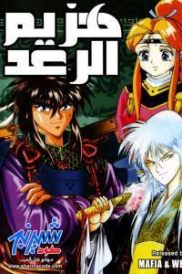

في عودة حميدة إلى كارتون الزمن الجميل وإلى زمن الصف الثاني الابتدائي تحديداً، قمت بشراء كامل سلسلة كارتون (هزيم الرعد)، والذي كان أكثر كارتون شاهدته وواصلت متابعته، إلى أن حال حائل ما ولم أشاهد الحلقة الأخيرة وكثيراً ما هي تلك المسلسلات والـ(الكراتين) التي تفوتني --كما تفوت الكثير-- الحلقة الأخيرة. وكعادة عمال محل الصرخة الخاص بالسيديهات والديفيديهات المملوئين ثقة و(غروراً)، فالسيدي الثالث معطوب للمرة الثانية توالياً، ولكنهم لا يخشون أن يحلفوا أيماناً مغلظة أن سيديهاتهم لم يمسها سوء ما دامت في رعايتهم، وهكذا تثبت استراحات ومقاهي النت جدارتها ضد محلات بيع السيديهات التجارية، فقط شاهد ثم انسخ، ماعدا -بالطبع- أصحاب المحلات الجشعين الذين يمنعوك من النسخ، وقد أصبحت هذه العادة منتشرة في أوساط محلات النت كالنار في الهشيم عدا أولئك الصابرين المرابطين الثابتين على حق الشعب في النسخ، ومن حقه أيضاً أن ينسخ لمحل النت المجاور بدون أي مانع.

وللعودة إلى (الإنمي) الذي كنت أشاهده والذي هو مقتبس بطبيعة الحال من (المانجا) الخاص بـ (هزيم الرعد)، لحظة من فضلك! ما معنى كلمات (الفرنجة) السابقة؟!

فالإنمي مصطلح خاص بمسلسلات الرسوم المتحركة، و العهدة على ويكيبيديا، أما المصطلح الناري وهو (المانجا) والذي لا يشير من قريب ولا بعيد إلى الفاكهة المعروفة، بل هو مصطلح يشير إلى قصص المجلات المصورة اليابانية أو المشابهة لها، والذي تكون معظم الإنيميهات اليابانية مقتبسة منها كهزيم الرعد. والعرب الذي لم يصطلحوا على معضلة الحرف (g) فبعض المراجع --وكأنه كلام علمي بحت-تسميه بال(مانغا)، ونحمد الله أنه لا يوجد من يقول بالقول الشاذ (مانكا)، وهذه التسميات والتي ليس من ورائها إلا النيل من أتباع الإنمي والتحريش بينهم، وللاطلاع راجع صفحة ويكيبيديا (الإنكليزية)، نعم بالكاف.

وبعد الاتفاق على التسمية، نعود إلى الإنمي، وتعتبر إعادة مشاهدته ليس تهوراً كبيراً ف52 حلقة ليست ك 800 حلقة وما فوق، وأصحاب (ون بيس)، (وناروتو)، وغيرهما يعلمون عن ماذا أتحدث، وكذلك فطول الحلقات فقط 20 دقيقة أو أقل، وليس (كجراءة) مسلسل (أرطغرل) ساعتين، هكذا بالفم المليان، عيني عينك، ما علينا، نعود لبطلنا وقصته التي حددت مصير المجرة بأكملها. تقول المجرة؟ نعم.

يقوم الجندي الجريء (راير يوجا)، يجب أن تعتادوا الأسماء اليابانية، يقوم بقتل حاكم (ساكورا) أمام ابنته (سيموني)حفيدة آخر أباطرة المجرة، والتي سيكون لها شأن في قصة المجرة، هؤلاء الأباطرة الذين حكموها واستقرت خلال ما يقرب 250 عاماً، حتى ساد النزاع والأطماع الشخصية التي فككت أبناء المجرة الواحدة، ويبقى السؤال من هذا الذي سينقذ الوضع ويحكم المجرة من جديد.

وفي هذا الجو المضطرب يقوم بطلنا (هزيم الرعد) بجرأته التي كادت أن تودي بحياته أن تجعله من أولي الحظوة لدى القائدة (روجينا) ، والتي تمثل أحد الأربعة الأقوياء، وهم أقوى قادة امبراطورية (قوجو)، كوكب البطل (هزيم الرعد)، وهؤلاء الأربعة الأقوياء: (روجينا) القائدة الطيبة ومساندة هزيم ، (جادر) القوي المتهور والذي يملك وجه (نمر) يشبه النمر المقنع تماما على أنه لم ينزعه طوال الإنمي!، الثالث هو (فورماي) صاحب المكائد والمؤامرات، والرابع هو (جين بي)، صاحب الملامح الهادئة جداً، والآراء السديدة. هذا على جانب الحلفاء والأصدقاء، أو كما يبدو في أول الأمر، لكن ظهر ما هو غير متوقع. هجوم خاطف على الإمبراطور من قبل (موسامي)، والذي لولا تدخل هزيم، لقتل الإمبراطور، هنا يتم ترقية هزيم ليصبح قائداً على المنطقة الجنوبية، ويلتقي، بالقائد (رماح) والمخطط العبقري (شاهين(، أرأيتم أسماء عربية أخيراً، ويلتقي أيضاً ب(سانقراكوساي) والقائد(كوين) و(كاوبو)، و السفينة الحربية (الصاعقة) وهكذا يصبح بطلنا رقماً صعباً في معادلة حكم المجرة ...

إلى هنا سأنهي تلخيص البداية لعدم حرق الأحداث لمن كان له حنين إلى الماضي، ويرغب في مشاهدة الإنمي من جديد، أما باردي المشاعر كـ(شاهين) فلا ينفع معه شيء للأسف.

وكل ما حدث وسيحدث يتطلب المعارك، المعارك في الفضاء، بسفن تشبه سفن البحر، وعند مواجهة الجيوش تكون السيوف هي وسيلة القتال المتوفرة، هل يوجد جنون مثل هذا ؟!! ولا يأتي أحد لابسا طيلسان العلم والواقعية، ويتحدث عن الأوكسجين والجاذبية على الفضاء.

علماً بأن جميع القادة يمدحون أعدائهم ويشيدون بشجاعتهم في كل المعارك وتنتهي المعركة غالباً بنزال بالسيوف بين القائدين.

وعلينا ألا ننسى دور الدبلجة العربية الرائعة جداً، والتي أجادت كل الأصوات وكأنها لا تصلح إلا هي وخاصة الراحل زياد الرفاعي -رحمه الله- في دور (هزيم الرعد). لا وجود للحقد، على الرغم من الكثير من المواقف المؤلمة والحزينة جداً والتي ستأتي متأخرة نوعاً ما ولكنها على كل حال ستأتي وستؤثر فيك حقاً، مع تخلل الإنمي بالكثير من المواقف الطريفة والمضحكة، ولكن السؤال الأهم هل سيتم توحيد المجرة وتحقيق حلم كل أبنائها، هذا ما ستجيبه الحلقات الحافلة بكثير من المفاجآت.

ولمعلومات مفصلة تفضلوا بزيارة [صفحة ويكيبيديا](https://ar.wikipedia.org/wiki/%D9%87%D8%B2%D9%8A%D9%85_%D8%A7%D9%84%D8%B1%D8%B9%D8%AF) العربية الخاصة بهزيم الرعد. 

أبرقي أرعدي أبطالاً وعدوك أنجب وعد

جاؤوك بسيف الحق الهادر كهزيم الرعد

*نشر لأول مرة قبل فترة طويلة لم أعد أذكرها تحديدا. لا يهم. أرجو أن المقال أعجبك وهذا هو المطلوب. *